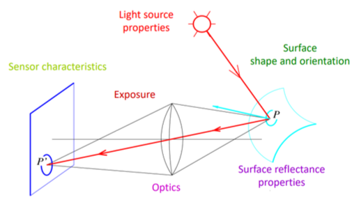
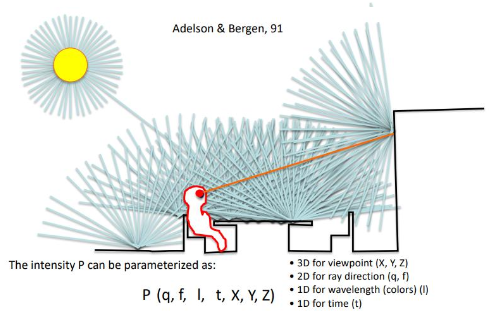
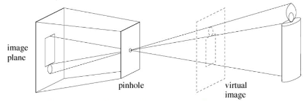
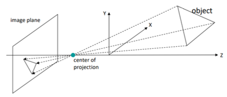
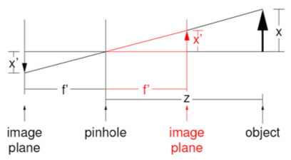
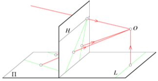
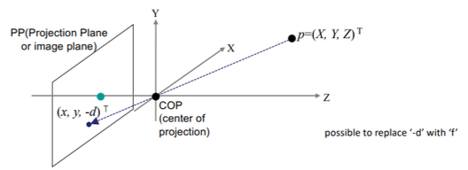
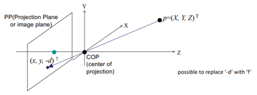
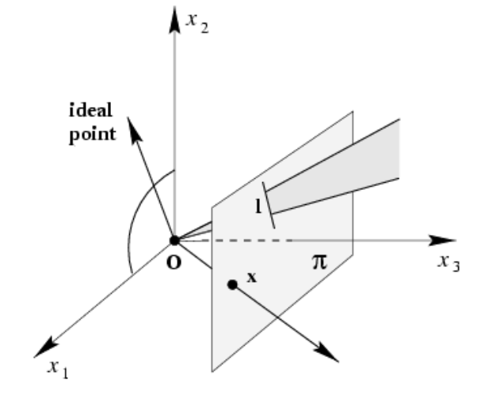

# 2 Image Formation

**image**란 다음과 같이 정의할 수 있다.

- 3D world를 2D image plane으로 **projection**(사영, 투영)한 것.

- 밝기 값으로 이루어진 2차원 패턴(2-dimensional patterns of brightness values)

따라서 image의 개념을 알기 위해서는 우선 **projective transform**(사영 변환)을 알아야 한다. projective transform이 보존하는 기하 속성은 무엇일까?

- 예를 들어 원이 타원으로 나타나기도 하므로 '모양'은 아니다.

- 마찬가지로 원의 반경도 서로 수직인 반경끼리 '길이'가 보존되지도 않는다.

- 이런 식으로 각도, 거리, 거리 비율도 보존되지 않는다.

이렇게 보존되지 않는 속성이 많다면 보존하는 기하 속성은 과연 무엇일까? 바로 **straightness**(직진성)이다. 게다가 이러한 속성은 바로 **mapping**(사상)에서 요구하는 가장 기초적인 사항이다.

---

## 2.1 Image Formation



**image formation**(이미지 형성)에 영향을 미치는 요소는 다양하다. 예를 들면 태양이나 전구와 같은 light source(energy resource)가 필요하며, light source의 특징에 따라서도 image formation이 달라진다. light가 물체에 도달하면 반사되어 카메라와 같은 imaging system에 도달하게 된다.

- light source properties

- surface shape and orientation: 물체 표면의 방향성, 질감, 색깔 등에 따라 다르다.

- optics: 렌즈가 어떤 종류인지 따라 다르다.(굴절률, 렌즈의 종류 등)

- sensor characteristics: 조리개, 셔터 스피드 등

---

## 2.2 structure of ambient light

**ambient light**(주변광, 환경광)란 scene 내 모든 object들에게 전 방향에서 비춰주는 조명을 의미한다. 자연적(태양 또는 달, 주변 불빛)이 해당된다. light의 **intensity**는 $P$ 는 다음과 같은 요인들에 의해 결정된다.

> 빛 a가 물체 A에 부딪혀 반사된 뒤 물체 B에 도달했다면, 빛 a는 물체 B에 대한 ambient light라고 지칭할 수 있다.

> elevation angle(고각, 고도각): 수평선에서 측정한 태양의 각 높이를 의미한다.



$$ P (q, f, l, t, X, Y, Z) $$

- 3D for viewpoint (X, Y, Z)

- 2D for ray direction (q, f)

- 1D for wavelength(colors) (l)

- 1D for time (t)

---

## 2.3 Cameras

- pinhole projection model

    - qualitative properties

    - perspective projection matrix

- cameras with lenses

- digital cameras

---

### 2.3.1 Pinhole Camera



옛날 필름을 이용한 카메라에서는, 필름 한 픽셀에 매우 적은 빛(pencil of lay)만 받도록 제한을 해야만 했다. 맨 처음 이러한 방식으로 만든 카메라가 camera obscura(암상자 카메라)이며, 이러한 방식의 카메라를 **pinhole camera**라고 한다.



이제 그림을 보며 pinhole camera에 object가 어떻게 맺히는지 수식으로 나타내 보자. object X는 카메라 내부 image plane X'에 맺히게 된다.



> 빨간색 선: reflected image plane. 이를 이용한 측량도 가능하지만 정확히 정면에서 찍어야만 가능하다.

- f': **focal length**(초점 거리)로 'pinhole(바늘 구멍)에서 뒷 벽면까지의 거리'를 의미한다.

   > 일반적으로 **focal length**(초점 거리)는 렌즈 ~ image sensor까지의 거리를 의미한다.

- Z: object가 camera에서 떨어진 거리

맺힌 image X'는 다음과 같이 나타낼 수 있다.

$$ X' = (f' / Z) X $$

> 이러한 특징 때문에, object와 camera가 떨어진 거리 Z가 멀수록 맺히는 image X'도 작아진다.

---
## 2.4 properties of projection

projection의 특징을 알아보자.

- object가 camera와 멀리 떨어질수록 image는 작아진다.

- parallel lines(평행선)는 **vanishing point**(소실점) 한 점으로 모이게 된다.(converge) 

    

    space(공간)상 **모든 direction은 각자의 vanishing point를 가지고 있다.**

    > 하지만 **image plane과 평행한 line들**만큼은, image 내에서도 **여전히 parallel**하게 남는다.

    > (2차원 projective space) vanishing point들을 모으면 하나의 직선이 된다. 이를 **line at infinity**라고 한다.

참고로 아래와 같은 두 직선의 방정식이 있다고 할 때, $a = a', b = b'$ 를 만족하지만 $c \neq c'$ 인 경우 두 직선이 **parallel**하다.

$$ ax + by + c = 0 $$

$$ a'x + b'y + c' = 0 $$

projection의 geometric properties로는 다음과 같은 종류가 있다.

- points(점): points가 된다.

- lines(직선): lines가 된다.

- planes(평면): whole image 혹은 half-plane이 된다.

    > 공간 위에 한 직선은 그 plane을 두 부분으로 나누는데, 각각을 half-plane(반평면)이라고 한다.

- polygons(다각형): polygons가 된다.

- **degenerates** case: focal point(초점)을 지나는 경우

    - line: point가 된다.

    - plane: line이 된다.

---

## 2.5 Coordinate System

**approximation**(근사)를 하기 위해 앞서 본 pinhole model을 사용해 보자. 다음과 같은 좌표계를 상정한다.



- origin(원점): **COP**(Center Of Projection)를 위치시킨다.(optical center)(focal point)

- COP 뒤쪽에 image plane(**Projection Plane**, **PP**)을 위치시킨다.

3차원상 하나의 Ray는 projective space에서 하나의 점으로 projection된다. 이를 효율적으로 나타내기 위해서 사용하는 것이 **homogeneous coordinates**이다. (참고로 우리가 사는 실제 3차원 공간은 **Euclidean space**(유클리드 공간) ${\mathbb{R}}^3$ 이라고 부른다.)

> image는 3차원 공간에 있는 point들을 PP에 projection한 것이다. focal point와 projection된 point를 연결하면 하나의 긴 projection ray(투영선)이 나온다. 이 ray에 위치한 모든 점은 동일한 한 point로 projection된다.

> 따라서 하나의 point로 projection되는 모든 point들을 한꺼번에 표현할 수 있는 좌표계가 있다면 효과적일 것이다. 이것이 바로 homogeneous coordinates을 사용하는 이유다.

유클리드 기하는 물체의 각도와 모양을 서술하는 기하인데, 대부분의 선과 다르게 두 개의 선이 만나지 않는 '평행'한 경우가 있다. 유클리드 기하에서는 이 문제를 해결하기 위해 일반적으로 평행선이 **point at infinity**(무한점)에서 만난다고 정의한다.(**ideal point**(이상점)이라고도 부른다.)

> 3차원에서는 **plane at infinity**(무한면)을 만들어 낸다.

---

### 2.5.1 Homogeneous Coordinates

**homogeneous coordinates**(동차 좌표)를 쉽게 말하면, (Euclidean plane) image상의 (wx, wy)를 (wx, wy, w)로 확장하여 표현하는 것이다. 즉, scale은 무시된 채 (x,y)에 대한 좌표 표현만 무한히 많이 존재하게 된다.

- 0이 아닌 $w$ 에서 $(wx, wy, w)$ 는 같은 점을 나타내게 되므로, 형식적으로 점들을 삼중 좌표의 **equivalent class**(동치 클래스)로 표시된다.

> 3차원의 경우 (X, Y, Z)를 (wX, wY, wZ, 1)로 표현한다.

> 이런 식으로 유클리드 공간 ${\mathbb{R}}^n$ 을 사영 공간 ${\mathbb{P}}^n$ 으로 확장할 수 있다. 

다시 말해 homogeneous coordinates에서 다음 두 좌표는 같다.

$$ (x, y, \alpha) = ({{x} \over {\alpha}}, {{y} \over {\alpha}}, 1) $$

이러한 특성으로 point at infinity를 설명할 수도 있다. $(x, y, 0)$ 에 해당하는 점은 없으며, $\alpha = 0$ 으로 둔 다면 $({{x} \over {0}}, {{y} \over {0}})$ 은 무한대가 되기 때문이다.

> 참고로 모든 point at infinity는 하나의 직선 위에 위치하게 된다. $(x, y, 0)(0, 0, 1)^{\mathsf{T}} = 0$

역으로 homogeneous coordinates를 일반 좌표계로 변환하는 것도 가능하다. 끝 좌표가 1이 되도록 scale을 바꾼 후 1을 떼 내면 된다.

$$ (x, y, \alpha) = ({{x} \over {\alpha}}, {{y} \over {\alpha}}, 1) \rightarrow ({{x} \over {\alpha}}, {{y} \over {\alpha}}) $$

이제 점 (X, Y, Z)에서 COP로 향하는 ray의 intersection을 계산해 보자.



$$ (X,Y,Z) \rightarrow (-d{{X} \over {Z}}, -d{{Y} \over {Z}}) $$

혹은 다음과 같이 나타낼 수 있다.

$$ (X,Y,Z) \rightarrow (f{{X} \over {Z}}, f{{Y} \over {Z}}) $$

이처럼 ${\mathbb{P}}^2$ 를 ${\mathbb{R}}^3$ 에 있는 광선의 집합으로 보는 시점이 이해에 있어서 도움이 된다. 



- ${\mathbb{P}}^2$ 의 점( $\mathbf{x}$ ): ${\mathbb{R}}^3$ 의 원점을 지나는 광선으로 표현된다.

- ${\mathbb{P}}^2$ 의 선( $\mathbf{l}$ ): ${\mathbb{R}}^3$ 의 원점을 지나는 평면으로 표현된다.

- $x_{1}x_{2}$ 평면에 있는 선이 ideal point(이상점)을 나타낸다.

- $x_{1}x_{2}$ 평면이 line at infinity(무한선)을 나타낸다.

---

## 2.6 Basic Geometry

본격적인 내용으로 들어가기 앞서 간단히 기하학을 복습하고 가자. 

사실 원론적으로 기하학은 'point', 'line', 그리고 'point와 line의 관계'에 관한 학문이다. 순수한 기하학은 좌표를 사용하지 않는다. 좌표를 사용하지 않는 접근 방식에서 theorem(정의)를 서술하고 algebra(대수) 없이 기하학적 기본 요소로만 증명한다.(예: 유클리드의 고전 접근 방식)

하지만 데카르트 이후 기하학이 algebraicized(대수화)될 수 있으며, 좌표와 대수 개체로 서술할 수 있게 되었다. 

- point는 적절한 좌표 basis(기저)에서 벡터와 동일시한다.

- line 또한 벡터로 동일시한다.

- 원뿔(원뿔 곡선)은 대칭 행렬로 표현한다.

따라서 기하학은 순수한 geometric한 접근 방식과 algebraic한 접근 방식이 존재한다는 점을 명심하자.

---

### 2.6.1 2D projective plane: 열벡터, 행벡터

평면 위 한 점은 벡터 공간 ${\mathbb{R}}^2$ 의 좌표 $(x, y)$ 로 표현할 수 있다. (따라서 보통 평면과 벡터 공간 ${\mathbb{R}}^2$ 를 동일시 한다.) 따라서 점은 벡터와 동일시되는 것이다. 

> 다시 말하면 '평면의 점이나 선은 벡터 공간의 homogeneous(동차) 표기법으로 나타낼 수 있다'는 뜻이다.

기본적으로 기하학 요소는 **column vector**(열벡터)로 나타내며, $\mathbf{x}$ 와 같이 <U>굵은 글씨로 나타낸 폰트 기호는 언제나 열벡터</U>를 나타낸다. 참고로 transpose(전치)인 row vector(행벡터)는 $\mathbf{x}^{\mathsf{T}}$ 로 나타낸다.

- 따라서 <U>평면의 한 점은 행벡터</U> $(x,y)$ <U>가 아닌 열벡터</U> $(x,y)^{\mathsf{T}}$ <U>로 표기</U>한다.

---

### 2.6.2 2D projective plane: 선의 homogeneous representation

평면에서 선은 직선의 방정식 $ax + by + c = 0$ 로 표현된다.( $a,b,c$ 를 바꾸면 다른 직선이 만들어진다.) 따라서 선도 자연스럽게 벡터 $(a, b, c)^{\mathsf{T}}$ 로 표현할 수 있다.

- 벡터 $(a, b, c)^{\mathsf{T}}$ 와, 0이 아닌 $k$ 에 대한 벡터 $k(a, b, c)^{\mathsf{T}}$ 는 동일한 선을 나타낸다. 따라서 이 두 벡터는 **scaling**과 관련되었을 뿐 동일한 벡터로 간주한다.(**equivalence class**에 속한 **homogeneous vector**)

 - 반대로 말해 벡터 $(a, b, c)^{\mathsf{T}}$ 자체가 equivalence class(동치류)를 나타내는 셈이다. 
    
그리고 어떤 선과도 대응되지 않는 벡터 $(0, 0, 0)^{\mathsf{T}}$ 를 제외한 " ${\mathbb{R}}^3 - (0, 0, 0)^{\mathsf{T}}$ "에서 벡터의 equivalence class는 projective space(사영 공간) ${\mathbb{P}}^2$ 를 형성한다.

---

### 2.6.3 2D projective plane: 점의 homogeneous representation

점 $\mathbf{x} = (x, y)^{\mathsf{T}}$ 가 직선 $\mathbf{l} = (a, b, c)^{\mathsf{T}}$ 위에 있을 필요충분조건은 다음과 같다.

$$ ax + by + c  = 0$$

이를 벡터의 내적으로 다음과 같이 표현할 수 있다.(스칼라 $1$ 과 벡터 $\mathbf{l}$ 구분에 주의)

$$ (x, y, 1)(a, b, c)^{\mathsf{T}} = (x, y, 1)\mathbf{l} = 0 $$

- 점 $\mathbf{x} = (x, y)^{\mathsf{T}}$ 에서 스칼라 값 1이 세 번째 차원으로 들어와서 3차원 좌표가 되었다.

- 위 식에 0이 아닌 스칼라 $k$ 값을 곱해도, $(kx, ky, k)\mathbf{l} = 0$ 으로 필요충분조건을 만족한다. 따라서 벡터 집합 $(kx, ky, k)^{\mathbf{T}}$ 는 벡터 공간 ${\mathbb{R}}^2$ 의 점 $(x, y)^{\mathsf{T}}$ 을 나타낸다고 간주할 수 있다.

즉, 선처럼 점도 동차 벡터로 나타낼 수 있다. 정리하면 ${\mathbb{R}}^2$ 에서 점 $(x_{1}/x_{3}, x_{2}/x_{3})^{\mathsf{T}}$ 은 다음과 같은 동차 벡터로 표현할 수 있다.

$$ \mathbf{x} = (x_{1}, x_{2}, x_{3})^{\mathsf{T}} $$

---
### 2.6.4 Degrees Of Freedom

잠시 **dof**(degree of freedom, 자유도)를 알아보자. dof는 변수를 몇 개를 자유롭게 바꿔서 근을 만들어 낼 수 있는지를 의미한다. 몇 가지 예시를 정리한 표로 살펴보자.

| 예시 | 변수 | 식  | 근 | dof |
| :---: | :---: | :---: | :---: | :---: |
| x = 6 | 1 | 1 | 1 | 0 |
| x + y = 7 | 2 | 1 | 근은 셀 수 없이 많다. $\infty$ | 근 하나를 바꾸면 나머지는 고정된다. 1 |
| x + y = 7, x - y = 2 | 2 | 2 | 1 | 0 |
| x + y + z = 7 | 3 | 1 | 근은 셀 수 없이 많다. $\infty$ | 근 두 개를 바꾸면 하나는 고정된다. 2 |

위 개념을 2차원 사영 공간에 적용해서 생각해 보자.

- 점 $\mathbf{x} = (x,y)^{\mathsf{T}}$ 을 지정하려면, x와 y 두 좌표를 지정해야 한다. 

- 선 역시 독립 비율의 두 개 변수를 지정해야 한다.(두 개를 지정하면 나머지 하나는 고정된다.)

따라서 <U>점과 선은 모두 dof 2</U>를 가진다.

---

### 2.6.5 Intersection of lines

그 다음은 두 개의 직선의 교점(intersection)을 살펴보자. 두 직선의 교점을 구하기 위해 직선의 방정식 둘을 연립해서 해를 구하는 방법도 있지만, 두 직선을 벡터로 표현한 뒤 **cross products**(외적)을 이용하면 더 간단하게 해를 구할 수 있다.

> [3Blue1Brown youtube: Cross products](https://youtu.be/eu6i7WJeinw): (1) 두 벡터의 외적으로 구해지는 결과는 마찬가지로 벡터다. (2) 결과 벡터의 크기는 두 벡터가 이루는 평행사변형의 면적이며, 두 벡터와 수직한 방향을 갖는다.(오른손 법칙으로 본 방향)

> 각도가 0 혹은 180도를 이루는 두 직선끼리 외적을 하면 크기가 0인 벡터가 된다.

> 직관적 이해: 두 직선 벡터의 외적으로 나온 벡터 $\tilde{\mathbf{v}} = (x, y, w)$ 가 있다고 하면, 교점의 좌표는 inhomogeneous coordinate $(x/w, y/w)$ 로 구할 수 있을 것이다. 

우선 두 직선 $\mathbf{l}, \mathbf{l}'$ 을 외적하여 얻은 결과 벡터 $\mathbf{x} = \mathbf{l} \times \mathbf{l}'$ 가 있다고 하자.

- $\mathbf{l} = (a, b, c)^{\mathsf{T}}$

- $\mathbf{l}' = (a', b', c')^{\mathsf{T}}$

cross product를 계산하면 다음과 같다.

```math
\mathbf{x} = \mathbf{l} \times \mathbf{l}' = \begin{bmatrix} \hat{i} & \hat{j} & \hat{k} \\ a & b & c \\ a' & b' & c \end{bmatrix}
```

```math
= \begin{bmatrix} b & c \\ b' & c' \end{bmatrix} \hat{i} - \begin{bmatrix} a & c \\ a' & c' \end{bmatrix} \hat{j} + \begin{bmatrix} a & b \\ a' & b' \end{bmatrix} \hat{k}
```

```math
= \begin{bmatrix} bc' - b'c \\ ca' - c'a \\ ab' - a'b \end{bmatrix}
```

위 결과를 inhomogeneous representation으로 바꿔서 얻는 좌표가 바로 교점의 좌표가 된다.

---

### 2.6.6 Intersection of parallel lines

그렇다면 평행한 두 직선에서 위와 같이 교점을 구하려고 하면 어떻게 될까? 이렇게 얻어낸 마지막 좌표가 0인 벡터를 바로 **ideal point**(이상점)이라고 한다.(혹은 **point at infinity**(무한점)이라고 부른다.)

평행한 두 직선의 방정식은 $\mathbf{l} = (a, b, c)^{\mathsf{T}}$ , $\mathbf{l} = (a, b, c')^{\mathsf{T}}$ 로 나타내자. 이 둘의 외적을 구하면 다음과 같은 결과를 얻을 수 있다.

$$ \mathbf{l} \times \mathbf{l}' = (b, -a, 0)^{\mathsf{T}} $$

- inhomogeneous representation으로 나타내면 $(b, -a)$ 가 된다.

이렇게 얻은 결과 벡터가 바로 ideal points를 나타낸다. 참고로 일반적으로 모든 ideal points의 집합은 벡터 표현 $(x_{1}, x_{2}, 0)^{\mathsf{T}}$ 혹은 $x_{1} : x_{2}$ 와 같이 비율로 나타낸다.

이러한 ideal points의 집합은 하나의 직선, **line at infinity**(무한선)에 위치하게 된다.

$$ (x_{1}, x_{2}, 0)(0, 0, 1)^{\mathsf{T}} = 0 $$

- line at infinity $\mathbf{l}_{\infty} = (0, 0, 1)^{\mathsf{T}}$

---
