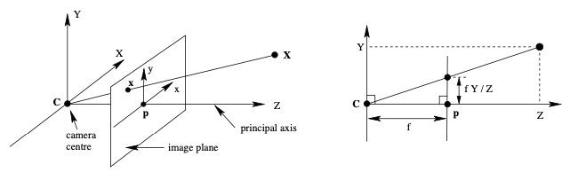
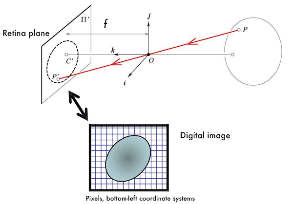
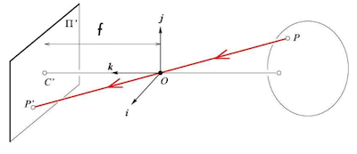
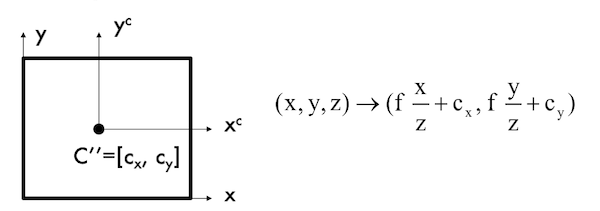
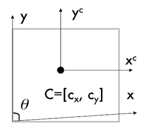
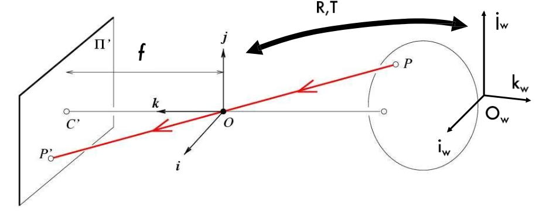
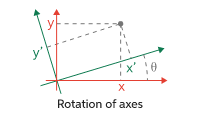
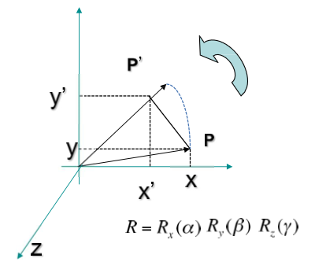

# 6 Camera Model

camera는 3D world(object space)를 2D image로 mapping하는 장치다. 여러 model이 있으며 현재 책에서는 **central projection**(중앙 사영)을 하는 camera를 중점적으로 다룬다.

> central projection은 **general projective camera**(일반 사영 카메라)의 special한 case이다. 참고로 specialize(특수화)할 때는 그 properties(속성)도 물려받게 된다.

camera의 specialized model은 크게 두 가지 분류로 나뉜다.

- **finite centre**를 갖는 camera model

- **infinite centre**를 갖는 camera model

  - 특히 **affine camera**는 parallel projection을 일반화한 model에 해당된다.

---

## 6.1 finite cameras: basic pinhole model

pinhole camera model을 다시 한 번 살펴보자. 기본적으로 pinhole model이 갖는 특징은 다음과 같았다.



- projection의 centre를 Euclidean coordinate system(유클리드 좌표계)의 origin(원점)으로 둔다.

  > **camera center**(카메라 중심) 혹은 **optical center**(광학 중심)으로도 부른다.

  > origin에서 image plane $Z$ 에 수직인 선을 camera의 **principal axis**(주축) 혹은 **principal ray**(주광선)이라고 부른다.

  > principal axis와 image plane이 만나는 점은 **principal point**(주점)이다.

  > image plane과 평행하게 origin을 지나는 평면은 **principal plane**(주평면)이다.

- image plane(이미지 평면) 혹은 focal plane(초점 평면)이라고 불리는 plane $Z = f$ 가 있다고 생각한다.

이제 3D point $P$ 를 image plane상의 2D point $P'$ 로 mapping할 것이다.

> 위 그림에서는 X와 x 기호로 표기되어 있다.

- $P$ : 공간상의 점 $P(x, y, z)$

```math
P = \begin{bmatrix} x \\ y \\ z \end{bmatrix}
```

- $P'$ : 평면 위에 projection된 점 $P'(x', y', f)$

```math
P' = \begin{bmatrix} x' \\ y' \\ f \end{bmatrix}
```

similar triangle에 의해 $x'$ 와 $y'$ 는 다음과 같은 수식으로 구할 수 있었다. 2차원 image plane이므로 3차원 좌표는 무시한다.

$$x' = f{{x} \over {z}}$$

$$y' = f{{y} \over {z}}$$

---

### 6.1.1 homogeneous coordinates representation

그런데 camera에서는 이렇게 구한 retina plane상의 2D point $P'$ 좌표를 그대로 사용하지 않는다. 한 차례 더 2D → 2D transform이 더 진행되어야 digital image가 된다.



> bottom-left coordinate systems: 좌하단을 origin (0,0)으로 두는 좌표계

제대로 살펴보기 앞서, central projection을 더 간단히 표현할 수 있는 **homogeneous coordinates**(동차 좌표)로 변환해 보자. 앞서 Euclidean coordinates에서 2D point $P'$ 의 좌표 $x', y'$ 는 다음과 같았다.(3차원 좌표는 무시)

$$x' = f{{x} \over {z}}$$

$$y' = f{{y} \over {z}}$$

위 식을 matrix multiplication 관점으로 다시 표현하면 다음과 같다.

```math
\begin{bmatrix} x \\ y \\ z \\ 1 \end{bmatrix} \rightarrow \begin{bmatrix} fx \\ fy \\ z \end{bmatrix} = \begin{bmatrix} f & & & 0 \\ & f & & 0 \\ & & 1 & 0 \end{bmatrix} \begin{bmatrix} x \\ y \\ z \\ 1 \end{bmatrix}
```

- 위 수식은 $\mathrm{diag}(f, f, 1)[\mathrm{I}|0]$ 으로 표현할 수 있다.

  > $\mathrm{diag}$ : diagonal matrix(대각 행렬). 주대각선 성분이 아닌 모든 성분이 0인 matrix를 의미한다.

  > $[\mathrm{I}|0]$ : $I$ :identity matrix(항등 행렬)와 $0$ :zero matrix(영 행렬) 을 합친 matrix임을 의미한다.

수식의 world point이며 4D vector인 $(x, y, z, 1)^{\mathrm{T}}$ 를 $P$ , 그리고 3D homogenous vector를 $P'$ 으로 두면 식을 더 간단하게 나타낼 수 있다.

$$ P' = \mathrm{M}P $$

- $\mathrm{M} = \mathrm{diag}(f, f, 1)[\mathrm{I}|0]$

---

### 6.1.2 non-square pixels case

하지만 만약 non-square pixel을 갖는 경우라면, point $P'$ 의 좌표 표현이 달라지게 된다.



$$x' = {\alpha}{{x} \over {z}}$$

$$y' = {\beta}{{y} \over {z}}$$

- $\alpha = fk$

- $\beta = fi$

---

### 6.1.3 camera coordinate frame

이제 **principal point**(주점)의 좌표( $c_{x}, c_{y}$ )를 고려해서 offset항을 추가해 보자.



$$x' = f{{x} \over {z}} + c_{x}$$

$$y' = f{{y} \over {z}} + c_{y}$$

이 경우 matrix multiplication 관점으로 표현하면 수식은 다음과 같다.

```math
\begin{bmatrix} x \\ y \\ z \\ 1 \end{bmatrix} \rightarrow \begin{bmatrix} fx + zc_{x} \\ fy + zc_{y} \\ z \end{bmatrix} = \begin{bmatrix} f & & c_{x} & 0 \\ & f & c_{y} & 0 \\ & & 1 & 0 \end{bmatrix} \begin{bmatrix} x \\ y \\ z \\ 1 \end{bmatrix}
```

- 만약 non-square pixel을 갖는 경우, 수식은 다음과 같이 표현된다.

```math
\begin{bmatrix} x \\ y \\ z \\ 1 \end{bmatrix} \rightarrow \begin{bmatrix} \alpha x + zc_{x} \\ \beta y + zc_{y} \\ z \end{bmatrix} = \begin{bmatrix} \alpha & & c_{x} & 0 \\ & \beta & c_{y} & 0 \\ & & 1 & 0 \end{bmatrix} \begin{bmatrix} x \\ y \\ z \\ 1 \end{bmatrix}
```

위 수식을 바탕으로 **camera calibration matrix**(카메라 보정 행렬) $K$ 를 정의하면, 더 간단하게 $K[\mathrm{I}|0]$ 와 같이 수식을 표현할 수 있다.

$$ P' = K[\mathrm{I}|0]P $$

이렇게 구한 좌표계를 **camera coordinate frame**(카메라 좌표계)라고 지칭한다.

---

### 6.1.4 camera skewness

**Camera skewness**란 image sensor의 cell array가 기울어진 경우를 의미한다.(최신 camera에서는 대체로 skew error가 거의 발생하지 않는다. 따라서 보통 고려하지 않는다.)



$\theta$ 를 감안할 경우 camera calibration matrix는 다음과 같이 작성된다.

```math
P' = \begin{bmatrix} \alpha & \alpha \cot {\theta} & c_{x} & 0 \\ & {{\beta} \over {\sin \theta}} & c_{y} & 0 \\ & & 1 & 0 \end{bmatrix} \begin{bmatrix} x \\ y \\ z \\ 1 \end{bmatrix} $$
```

- 위 camera calibration matrix $K$ 의 dof(degree of freedom): 5.

---

### 6.1.5 Canonical projective transformation

다음과 같이 matrix 원소로 오직 1과 0만 갖는, identity matrix $I$ 와 zero matrix $0$ 가 붙어있는 matrix를 통한 transformation을 **canonical projective transformation**이라고 한다.

```math
P' = \begin{bmatrix} x \\ y \\ z \end{bmatrix} = \begin{bmatrix} 1 & 0 & 0 & 0 \\ 0 & 1 & 0 & 0 \\ 0 & 0 & 1 & 0 \end{bmatrix} \begin{bmatrix} x \\ y \\ z \\ 1 \end{bmatrix}
```

- canonical projection matrix $M$ 으로 표현 시 $P' = MP$

- 사실상 ${\mathbb{R}}^3 \rightarrow {\mathbb{R}}^2$ 연산 

결과로 얻는 point $P'$ 의 좌표는 다음과 같다.

$$x' ={{x} \over {z}}$$

$$y' = {{y} \over {z}}$$

---

## 6.2 world reference system

만약 camrera가 여러 개 있는 system이라면, 기준이 되는 좌표계를 어떻게 설정해야 될까? 이때는 한 camera를 기준으로 world coordinate을 설정한 뒤, 나머지 camera coordinate가 world coordinate에 맞춰지도록 transformation( $R, T$ matrix )을 수행해야 한다.



---

### 6.2.1 2D transform: translation

우선 기초가 되는 2D transform부터 살펴보자. 만약 2D point $P=(x,y)$ 를 $t_{x}, t_{y}$ 만큼 **translation**(이동)시키고 싶다면, translation 후 point $P'$ 는 다음과 같은 좌표가 될 것이다.

> 병진 운동(직선으로 움직이는 운동)이라고도 부른다.

$$ P' = P + t = (x + t_{x} , y + t_{y}) $$

위 point $P'$ 를 homogeneous coordinates을 이용한 matrix multiplication 관점에서 표현하면 아래와 같다.

```math
P' \rightarrow \begin{bmatrix} x + t_{x} \\ y + t_{y} \\ 1 \end{bmatrix} = \begin{bmatrix} 1 & 0 & t_{x} \\ 0 & 1 & t_{y} \\ 0 & 0 & 1 \end{bmatrix} \begin{bmatrix} x \\ y \\ 1 \end{bmatrix} = \begin{bmatrix} I & t \\ 0 & 1 \end{bmatrix} \begin{bmatrix} x \\ y \\ 1 \end{bmatrix}
```

- 간단하게 translation matrix $T$ 를 정의하면 다음과 같이 쓸 수 있다.

```math
P' = T \begin{bmatrix} x \\ y \\ 1 \end{bmatrix}
```

---

### 6.2.2 2D transform: scaling

다음은 2D **scaling**을 적용해 보자. 2D point $P=(x,y)$ 에 scaling을 적용해서 $P'=(s_{x}x, s_{y}y)$ 를 얻었다고 하자.

```math
P' \rightarrow \begin{bmatrix} s_{x}x \\ s_{y}y \\ 1 \end{bmatrix} = \begin{bmatrix} s_{x} & 0 & 0 \\ 0 & s_{y} & 0 \\ 0 & 0 & 1 \end{bmatrix} \begin{bmatrix} x \\ y \\ 1 \end{bmatrix} = \begin{bmatrix} S' & 0 \\ 0 & 1 \end{bmatrix} \begin{bmatrix} x \\ y \\ 1 \end{bmatrix}
```

- 간단하게 scaling matrix $S$ 를 정의하면 다음과 같이 쓸 수 있다.

```math
P' = S \begin{bmatrix} x \\ y \\ 1 \end{bmatrix}
```

---

### 6.2.3 2D transform: rotation

다음은 2D **rotation**을 적용해 보자. 2D point $P=(x,y)$ 에 rotation을 적용한 point $P'$ 는 다음과 같은 좌표를 얻게 된다.



$$ x' = \cos {\theta}x - \sin {\theta} y $$

$$ y' = \cos {\theta}y + \sin {\theta} x $$

위 $P'$ 은 다음과 같이 matrix multiplication 관점으로 표현할 수 있다.

```math
P' \rightarrow \begin{bmatrix} \cos {\theta} & - \sin {\theta} & 0 \\ \sin {\theta} & \cos {\theta} & 0 \\ 0 & 0 & 1  \end{bmatrix} \begin{bmatrix} x \\ y \\ 1 \end{bmatrix}
```

- 간단하게 rotation matrix $R$ 를 정의하면 다음과 같이 쓸 수 있다.

```math
P' = R\begin{bmatrix} x \\ y \\ 1 \end{bmatrix}
```

> dof는 $\theta$ 1개이다.

---

### 6.2.4 2D transform: scaling + rotation + translation

위 2D transform을 모두 합치면 다음과 같은 matrix가 된다.

```math
P' \rightarrow \begin{bmatrix} RS & t \\ 0 & 1 \end{bmatrix} \begin{bmatrix} x \\ y \\ 1 \end{bmatrix}
```

- 만약 scaling의 $s_{x}, s_{y}$ 값이 동일하다면 **similarity transformation**이다.

-  dof: 총 4개 혹은 5개를 갖는다.

   - rotation: $\theta$ (1개) 
   
   - translation: $t_{x}$ , $t_{y}$ (2개) 
   
   - scaling: 1개( $s_{x} = s_{y}$ ) 혹은 2개( $s_{x} \neq s_{y}$ )

이처럼 물체의 변형(찌그러짐)이 없는 변환을 **similarity transformation**라고 한다.

---

### 6.2.5 3D transform: translation, rotation

4D homogeneous coordinates로 나타내게 된다. 

- 3D **translation**: 2D와 크게 차이가 없다. 

  - 단, $t_{z}$ 가 늘어서 dof가 3개로 늘어난다.

```math
P' = T \begin{bmatrix} x \\ y \\ z \\ 1 \end{bmatrix}
```

```math
P' \rightarrow {\begin{bmatrix} I & T \\ 0 & 1 \end{bmatrix}}_{4 \times 4} \begin{bmatrix} x \\ y \\ z \\ 1 \end{bmatrix}
```

- 3D **rotation**: x, y, z축마다 rotation matrix를 곱해야 한다.(counter-clockwise 방향)

  - dof는 $\alpha$ , $\beta$ , $\gamma$ 3개이다.

  > roll, pitch, yaw로 지칭하기도 한다.

    

```math
R_{x}(\alpha) = \begin{bmatrix} 1 & 0 & 0 \\ 0 & \cos {\alpha} & - \sin {\alpha} \\ 0 & \sin {\alpha} & \cos {\alpha} \end{bmatrix}
```

```math
R_{y}(\beta) = \begin{bmatrix} \cos {\beta} & 0 & \sin {\beta} \\ 0 & 1 & 0 \\ - \sin {\beta} & 0 & \cos {\beta} \end{bmatrix}
```

```math
R_{z}(\gamma) = \begin{bmatrix} \cos {\gamma} & - \sin {\gamma} & 0 \\ \sin {\gamma} & \cos {\gamma} & 0 \\ 0 & 0 & 1 \end{bmatrix}
```

$$ R = R_{x}(\alpha)R_{y}(\beta)R_{z}(\gamma) $$ 

point $P$ 에 3D rotation을 적용하면, point $P'$ 로 다음과 같은 좌표를 얻게 된다.

```math
P' \rightarrow {\begin{bmatrix} R & 0 \\ 0 & 1 \end{bmatrix}}_{4 \times 4} \begin{bmatrix} x \\ y \\ z \\ 1 \end{bmatrix}
```

- **rigid transformation**: 3D translation + 3D rotation

```math
P' \rightarrow {\begin{bmatrix} R & T \\ 0 & 1 \end{bmatrix}}_{4 \times 4} \begin{bmatrix} x \\ y \\ z \\ 1 \end{bmatrix}
```

---

## 6.3 projective transformation

rigid transformation 식에 camera coordinate frame 변환도 포함해서 고려하면 다음과 같은 식이 된다.

```math
P' \rightarrow K[\mathrm{I}|0] {\begin{bmatrix} R & T \\ 0 & 1 \end{bmatrix}}_{4 \times 4} P_{w} = K[R|T]P_{w}
```

> $P$ 가 world coordinate임을 강조하기 위해 $P_{w}$ 로 표현.

- **internal parameter**: camera calibration matrix K

- **external parameter**: rotation, translation matrix R, T(camera pose와 관련)

matrix의 크기를 보면, $K$ : 3x3, $[R|T]$ : 3x4, $P_{w}$ : 4x1 이다. 

- $K[R|T] = M$ 으로 두게 되면 $M$ 은 3x4 matrix가 된다.

- $M$ 의 dof는 K(skew 고려 5) + R(3) + T(3) = 11이 된다.

$M$ 을 ${[m_{1} , m_{2}, m_{3}]}^{\mathrm{T}}$ 로 더 간단하게 표현할 수 있다.

```math
P' \rightarrow \begin{bmatrix} m_{1} \\ m_{2} \\ m_{3} \end{bmatrix}P_{w} = \begin{bmatrix} m_{1}P_{w} \\ m_{2}P_{w} \\ m_{3}P_{w} \end{bmatrix}
```

2D point로 나타내면 다음과 같다.

$$ ({{m_{1}P_{w}} \over {m_{3}P_{w}}}, {{m_{2}P_{w}} \over {m_{3}P_{w}}}) $$

---