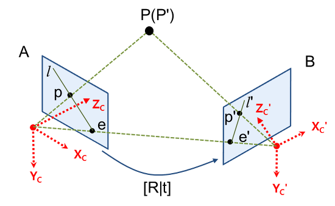

# 9 Epipolar geometry and the fundamental matrix

**epipolar geometry**(등극 기하학)은 '두 view(시점) 사이의 projective geometry'이다. 

> 간단히 말하자면 동일한 사물이나 장면을 서로 다른 두 시점에서 획득했을 때, image A, B가 서로 이루는 기하학적 관계를 다루는 것이다.

- scene structure(장면 구조)와 무관하다.

- 오직 **camera의 internal parameters**(내부 패러미터), **relative pose**(상대 자세)에 depend한다.

---

## 9.1 epipolar geometry

> [Epipolar Geometry 설명](https://darkpgmr.tistory.com/83)

다음 그림을 보자. 3D point(3차원 점) $P$ 는 image A, B에 각각 2D point $p$ , $p'$ 로 project된다.

- **epipole**: 두 camera centre(카메라 중심)을 이으면서 생기는 직선이, 각 image plane에서 만나는 점이 바로 **epipole**(등극점) $e$ , $e'$ 이다.

- **epipolar line**: $p$ 와 $e$ 를 이어서 생기는 직선 $l$ , $p'$ 와 $e'$ 를 이어서 생기는 직선 $l'$ 이 바로 **epipolar line**(등극선)이다.(epiline으로도 부른다.)

그림을 잘 보면 두 카메라 중심( $C$ , $C'$ 로 지칭. )과 $P$ 를 이으면 삼각형처럼 보이는 평면이 있다. 이를 **epipolar plane**(등극면)이라고 한다.

이제 epipolar plane 관점에서 다시 위 그림을 살펴보자.

- $p$ , $p'$ : 두 point는 epipolar plane $\pi$ 위에 위치해 있다.

  - back-project(역사영): camera centre $C$ ( $C'$ ) 에서 point $p$ ( $p'$ )를 잇는 ray는 $P$ 에서 만난다.

- $l$ , $l'$ : 두 epipolar line은 epipolar plane $\pi$ 위에 위치해 있다.

이제 감이 잡힐 것이다. 만약 두 camera 위치 사이의 기하학적 관계 [R|t]를 알고 있고, image A의 2D point $p$ 를 알고 있다면, image B의 2D point $p'$ 를 구할 수 있지 않을까?

- 만약 A에서 P까지의 depth(거리)를 알고 있다면, $p'$ **도 구할 수 있다.**

- 하지만 A에서 P까지의 depth를 모른다면 $p'$ 를 구할 수 없지만, 대신 $p'$ 가 존재할 수 있는 **유일한 epipolar line** $l'$ **는 구할 수 있다.**

위 그림에서 만약 3D point $P$ 가 바뀌게 되면, epipolar plane $\pi$ 는 epipole $e$ , $e'$ 를 이은 baseline을 기준으로 회전하게 된다.

- 이러한 plane들의 집합을 **epipolar pencil**(등극 꾸러미)라고 지칭한다.

> 그림에서 $P$ 대신 $X$ 기호를 사용.

그리고 두 epipole 간의 기하학적 연산을 위해 사용하는 행렬이 바로 **Fundamental matrix**(기본 행렬) $\mathrm{F}$ 이다.

---

## 9.2 fundametal matrix

앞서 본 것처럼 image A의 point $p$ 에 대응되는, image B의 epipolar line $l'$ 은 언제나 존재한다. 

- $p'$ 가 바로 $l'$ 위에 위치하고 있었다.

여기서 핵심은 "image A에서 point $p$ 와 camera centre $C$ 를 이은 ray를, image B에 project하면 epipolar line $l'$ 를 얻을 수 있다"는 것이다. 이렇게 $p$ 를 이용해서 $l'$ 을 구할 수 있는 matrix가 바로 **fundamental matrix** $\mathrm{F}$ 이며, 다음과 같이 표현할 수 있다.

$$ l' = \mathrm{F}p $$

---

### 9.2.1 geometric derivation

우선 fundamental matrix를 geometric derivation(기하학적 유도) 방법으로 구해보자.

1. **point tranfer via a plane**

    image A의 2D point $p$ 를 image B의 2D point $p'$ 로 **transfer**(전송)할 것이다. 
    
    > $p$ 로 3D point $P$ 를 구한 뒤, $P$ 를 image B에 project해서 구하는 것을 의미한다.

    이런 관계를 만족하는 행렬을 사용해서 수식으로 표현하면 다음과 같다.

$$ p' = {\mathrm{H}}_{\pi}p $$

2. **constructing the epipolar line**

    image B의 $p'$ 를 구했다면, 마찬가지로 image B의 epipole $e'$ 와 cross product를 하면 epipolar line $l'$ 를 구할 수 있다.( $l' = e' \times p'$ )

$$ l' = {[e']}_{\times}{\mathrm{H}}_{\pi}p = {\mathrm{F}}p $$

> 표기법에 주의. cross product는 $a \times b = {[a]}_{\times}b$ 와 같이 표기한다.

위 derivation으로 보듯이 fundamental matrix는 다음과 같이 표현된다.

$$ F = {[e']}_{\times}{\mathrm{H}}_{\pi} $$

- (image B) epipole $e'$ : 2D point이므로 rank 2.

- transfer을 위한 matrix $\mathrm{H}$ : rank 3.

따라서 $F$ 는 rank 2 matrix이다.

---

### 9.2.2 algebraic derivation

이번에는 fundamental matrix를 algebraic derivation(대수적 유도) 방법으로 구해보자. 우선 image A의 2D point $p$ 와 camera centre $C$ 에서, **back-project(역사영)된 ray** $M(\lambda)$ 를 구할 것이다.

> 그림에서는 $p$ 대신 $\mathrm{x}$ , $M$ 대신 $X$ 기호를 사용

back-project matrix를 $M$ 라고 두면, 수식은 $PM = p$ 가 될 것이다. parameter 하나를 갖는 해 집합을 계산하면 다음과 같다.(Part 1 참고)

$$ M(\lambda) = P^{+}p + \lambda C $$

-  $M^{+}$ : $M^{+}M = I$ 를 만족하는 pseudo-inverse matrix(유사 역행렬)

- $\lambda$ : $M^{+}p$ ( $\lambda = 0$ ) 부터 camera centre $C$ ( $\lambda = \infty$ ) 를 나타내는 scalar parameter

(생략)

---

### 9.2.3 fundamental matrix properties

fundamental matrix의 성질들을 알아보자.

1. **point correspondence**(점 대응)

    image B에서 point $p'$ 와 epipolar line $l'$ 을 내적하면, $p'$ 가 $l'$ 위에 위치하기 때문에 결과값은 0이 된다. ( ${p'}^{\mathrm{T}}l' = 0$ ) 따라서 다음 식을 만족한다.

$$ {p'}^{\mathrm{T}}{\mathrm{F}}p = 0 $$

> 위 식이 오직 fundamental matrix와 $p$ , $p'$ 로 구성된 식이라는 점이 핵심이다. 달리 말하면 $p$ , $p'$ 두 점만 있다면 fundamental matrix를 $\mathrm{F}$ 을 구할 수 있다는 말이다.

2. $\mathrm{F}$ 는 **rank 2 homogeneous matrix**이며 **dof 7**을 갖는다.

    $3 \times 3$ homogeneous matrix는 8개의 independent ratio를 가는데, $\mathrm{F}$ 는 $\mathrm{det}$ $\mathrm{F} = 0$ 을 만족해야 하므로 -1을 한 dof 7이 된다.

3. **epipolar lines**

   - $l' = \mathrm{F}p$ : $p$ 에 correspond(대응)하는 epipolar line

   - $l = \mathrm{F}p'$ : $p'$ 에 correspond(대응)하는 epipolar line

4. **epipoles**

   - $\mathrm{F} e = 0$

   - ${\mathrm{F}}^{\mathrm{T}} e' = 0$

---

