# 23 Light (Part I)

> [First Principle of Computer Vision](https://fpcv.cs.columbia.edu/Monographs)

이미지에서 pixel이 갖는 brightness는 어떻게 정해질까?

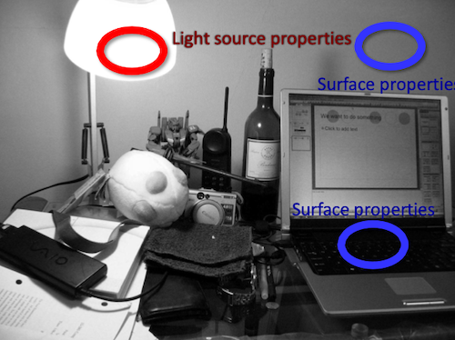

이를 이해하기 위해서는 image가 형성되기까지 어떠한 요소의 영향을 받는지 살펴봐야 한다.

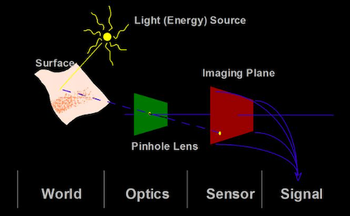

- world

  - **light source properties**(광원의 특성)
  
  - **surface shape** and **orientation**(사물의 표면과 방향)
   
  - **surface reflectance properties**(표면이 갖는 반사 특성)

- **optics**

- **sensor characteristics**

---

## 23.1 Radiometry

> [Radiometric Concepts | Radiometry and Reflectance](https://youtu.be/tflz0loWhIY)

광원(source)의 <U>빛</U>과 물체의 <U>표면</U>(receiver)의 <U>interaction으로 얼마나 표면이 '밝게'(bright) 빛날지</U>를 알아내는 것이 바로 **Radiometry**이다.

- **Radiometry**: 방사법. 전자기파(적외선, 가시광선, 자외선) 측정을 다루는 물리학의 한 분야

  - **Photometry**: 측광법. 가시광선 영역(380nm~780nm) 측정을 다루는 물리학의 한 분야

---

### 23.1.1 What is light?

사전적인 의미로는 빛이란 공간 상에 광선으로 전파되는 전자기파(Electromagnetic radiation, **EMR**)를 의미한다.

- $R(l)$ : 주로 Power 단위인 Watts를 사용하여 표현한다.

  - $l$ : wavelength

  > 1W의 전자기파: 1초동안 1J(N·m) 에너지가 전파되는 것

단위 면적에서 모든 방향의 radiant flux을 **irradiance**, 단위 면적, 단위 solid angle(즉, 특정 방향)의 radiant flux을 **radiance**라고 한다.

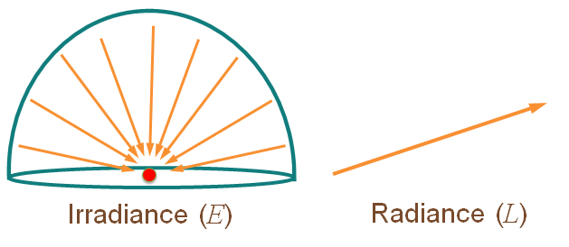

---

### 23.1.2 solid angle

우선 3차원에서는 **solid angle**(입체각) 개념을 사용한다. 단위는 steradian(square radian, 스테라디안, **sr**)으로, 면적( $A$ )을 거리 제곱( $r^2$ )으로 나눈 값이다.

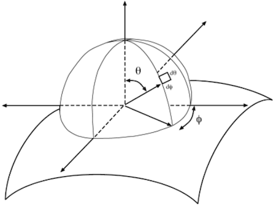

> 반구에서의 solid angle은 $2\pi$ sr, 전체 구면에서의 solid angle은 $4\pi$ sr이다.

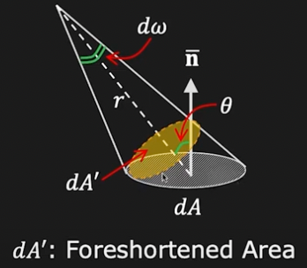

$$ d \omega = {{dA'} \over {r^2}} = {{dA \cos \theta} \over {r^2}} $$

---

### 23.1.3 light flux, radiant intensity

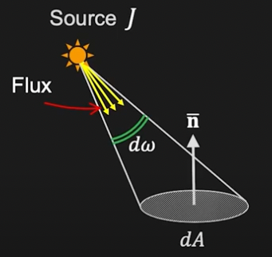

**light flux**란 solid angle에서 방출되는 power를 의미한다. $d\omega$ 에서 방출되는 power는 다음과 같다.

$$ d \Phi $$

- 단위: Watt

**radiant intensity**란 **unit** solid angle에서 방출되는 power를 의미한다.

$$ J = {{d \Phi} \over {d \omega}} $$

- 단위: Watt/steradian

---

### 23.1.4 surface irradiance, surface radiance

이제 **surface**와 관련된 개념을 살펴보자. **surface irradiance**는 단위 surface area에서의 light flux incident를 의미한다.

> **surface irradiance**는 종종 **intensity** $I$ 로 부르거나 표기한다. radiant intensity $J$ 와 혼동을 주의해야 한다.

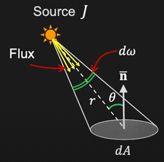

$$ E = {{d \Phi} \over {dA}} $$

- 단위: Watt/m^-2

- radiant intensity를 대입하면 식은 다음과 같이 바뀐다.( $J$ = radiant intensity, $r$ = distance from light source to surface )

$$ E = {{J d \omega} \over {dA}} = {{J{dA \cos \theta} \over {r^2}} \over {dA}} = {{J \cos \theta} \over {r^2}} $$ 

- **Lambert's Cosine Law**에 따르면 surface direction에 따른 irradiance는 다음과 같다.

  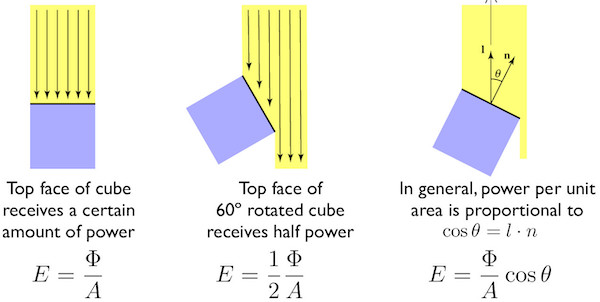

**surface radiance**는 단위 **foreshortend area**, 단위 solid angle에서 특정 방향으로 방출되는 radiant flux를 의미한다.

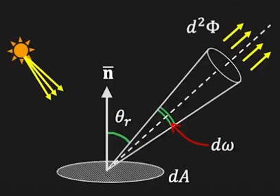

> camera sensor의 면적과 surface의 면적은 모두 surface radiance에 영향을 미친다.

$$ L = {{d^2 \Phi} \over {(dA \cos {\theta}_{r})d \omega}} $$

- 단위: Watt m^-2 sr^-1

> direction에 따라 radiance가 바뀌는 점에 주목하자. 또한 L은 surface의 reflectance에도 영향을 받는다.

---

### 23.1.5 look the same

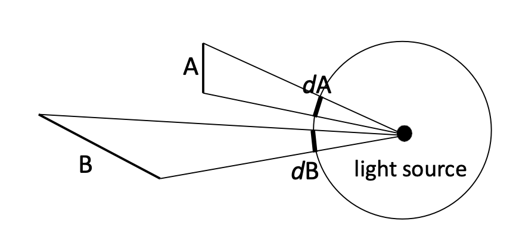

- A, B: receiver

- light source: 광원

A와 B의 표면적은 달라도 light source를 중심으로 그린 원에서는 $dA = dB$ 이므로, <U>receiver에 도달하는 energy의 총량은 같다.</U> 

> B가 표면적이 더 넓기 때문에 A보다는 어둡게 보일 것이다.

> 진공을 가정하기 떄문에 A와 B의 거리로 인한 빛의 산란이나 energy 감소는 고려하지 않는다.

---

## 23.2 light field

**light field**란 모든 지점(every point)과 모든 방향(every direction)에 도달하는 radiation을 정의한 개념이다. 이러한 light field는 **plenoptic function**을 통해 표현한다.

$$P(X, Y, Z, {\theta}, {\phi}, {\lambda}, t)$$

- observer의 위치(viewpoint)

  - $X, Y, Z$

- ray direction

  - $\theta$ : 방위각(azimuth angle)

  - $\phi$ : 고도각(zenith angle)

- light

  - $\lambda$ : wavelength

  - $t$ : time

plenoptic function $R$ 을 알고 있다면, 어떤 viewpoint에서 어떤 장면이 보일지 알 수 있다.

> 3D FPS 게임에서는 모든 지점에 대한 plenoptic function이 구현되어 있다.

---

### 23.2.1 plenoptic function

공간에 대한 시각 정보를 plenoptic function으로 표현한 예시를 보자.

1. grayscale snapshot

    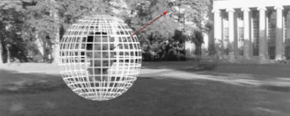

$$ P({\theta} , {\phi}) $$

- ${\theta} , {\phi}$ : ray direction

2. color snapshot

    

$$ P({\theta} , {\phi}, {\lambda}) $$

- $\lambda$ : intensity of light

3. movie

    

$$ P({\theta} , {\phi}, {\lambda}, t) $$

- $t$ : time

4. holographic movie

    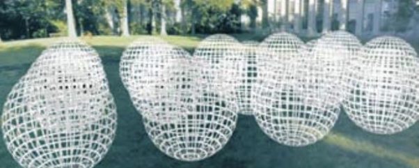

$$ P({\theta} , {\phi}, {\lambda}, t, V_{X}, V_{Y}, V_{Z}) $$

- $V_{X}, V_{Y}, V_{Z}$ : all possible viewpoints

    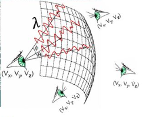

---

## 23.3 problem of plenoptic function

하지만 plenoptic function을 구하려고 해도, 일반적인 2D camera를 이용한다면 빛 각각의 intensity, direction 정보를 모두 잃게 된다.

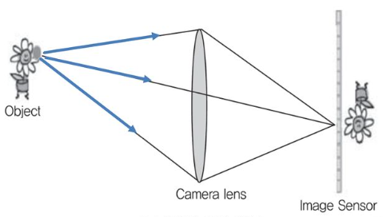

- 물체의 한 점에서 반사된 빛이 렌즈를 통과하면서 센서의 한 점에 모이면서, 빛의 intensity, direction 정보를 모두 잃게 된다.

또한 완전한 plenoptic function을 구하기는 어려운 일이므로, plenoptic function을 단순화하고 특수한 장치를 사용하여 plenoptic function을 구한다.

---

### 23.3.1 simplified light field

plenoptic function을 여러 가정을 추가하여 단순화시켜 보자. 

1. 빛의 파장(color)와 시간(time)을 무시한다. 그렇다면 plenoptic function을 5차원 수식으로 표현할 수 있다.

$$ P({\theta}, {\phi}, V_{X}, V_{Y}, V_{Z}) $$

- 3D position: $V_{X}, V_{Y}, V_{Z}$

- 2D direction: ${\theta}, {\phi}$

2. 추가로  light field가 진공(vacuum)이며 infinite line상에 있는 점을 구분하지 않는다(constant)고 가정하자. 그렇다면 plenoptic function을 4차원 수식으로 표현할 수 있다.(**4D light fields**)

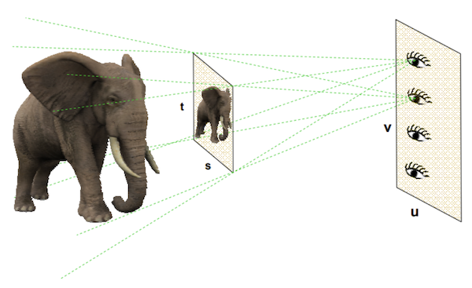

$$ P(u, v, s, t) $$

- $s, t$ : spatial domain. 2차원 공간 좌표계

- $u, v$ : angular domain. 2차원 방향 좌표계(조금씩 서로 다른 각도에서 본 좌표계를 뜻한다.)

> spatial domain(s, t)과 angular domain(u, v)의 연결로 방향성을 만들 수 있다. 

아래 4D light field의 예시를 보자. 

- 어떤 카메라의 해상도(resolution): 100x100

  - 즉, spatial domain 크기는 100x100.
  
- angular domain는 7x7

이 경우 총 700x700의 raw data를 얻거나, 혹은 7x7 영역 각각에서 100x100 image data(총 49개)를 얻을 수 있다.

---

### 23.3.2 capturing light field

light field를 획득하는 방법으로 대표적인 두 가지 방법을 살펴보자.

- multiple camera array: 다수 카메라 배열 방식

  - 2005년 Stanford 대학의 100대로 구성된 카메라 배열이 대표적이다.

    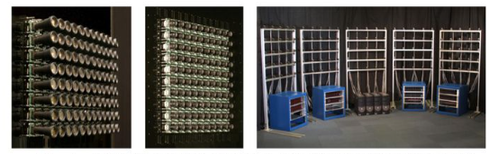

  - 카메라 시야각(Field of View)을 겹치게 배열하여 light field를 획득한다.

  > 비용이 비싸고 카메라 배치, 신호 이득(gain) 차이 문제로 calibration이 필요하다

- lens array: 렌즈 배열 방식

  - 일반 디지털 카메라의 image sensor 앞에 micro lens array를 위치시켜서 방향별 빛 정보를 저장한다.

    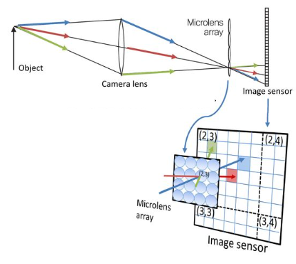

  > light field camera로 지칭한다. 단 구조적 문제로 FoV는 작아진다.

  > 대신 비용이 저렴하고, 별도의 calibration 없이 depth estimation이 가능하다.

---

## 23.4 light source

light source(광원)는 크게 세 가지 종류로 분류할 수 있다.

- point source: 점 조명

- directional source: 무한히 먼 거리에 있는 점 조명

  - 무한히 먼 거리에 있는 점 조명에서, 물체로 들어오는 빛은 모두 평행하게 한 방향의 빛만 들어오게 된다.

- area source: 점 조명의 집합

편의를 위해 보통 size가 없는 point source으로 가정한다.

- 모든 광원의 distribution을 light field을 통해 설명할 수 있다.

- 모든 광원은 wavelength 400~700nm 내 방출되는 에너지의 양으로 표현할 수 있다.

  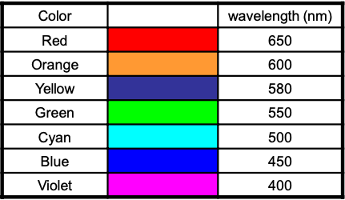

---

### 23.4.1 color

물체에서 반사되는 색상은 **illumination**과 **reflectance**의 interection으로 결정된다.

- **illumination**: luminous flux의 이동(transport)을 의미한다.(light sources(emitters) → surfaces(reflectors))

- **reflectance**: radiation이 surface에서 반사되어 나오는 비율을 의미한다. 

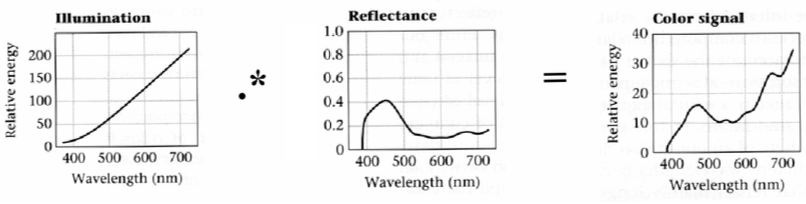

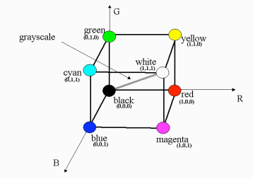

---