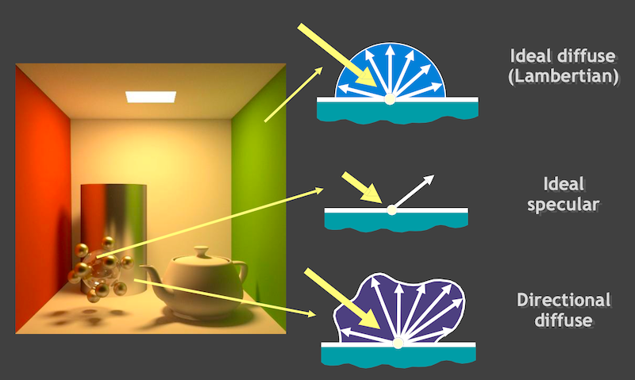
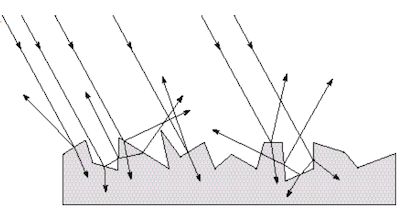
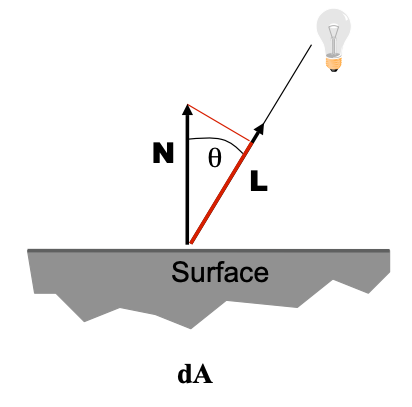
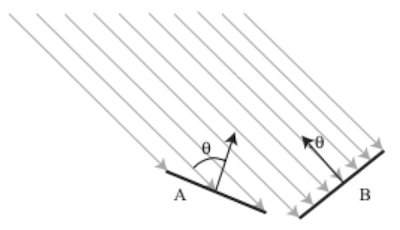
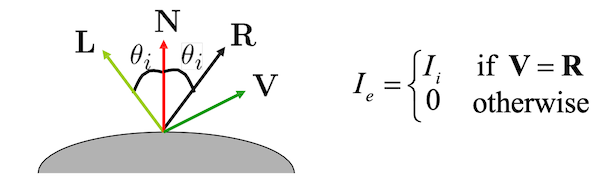
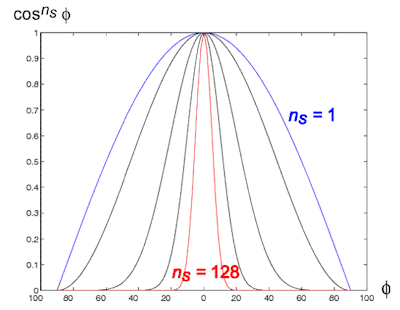
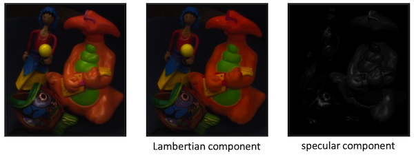
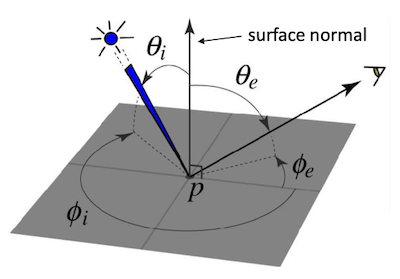
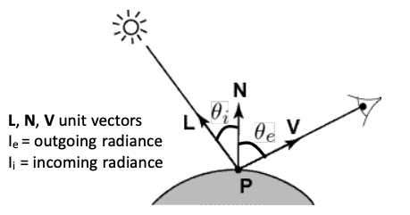
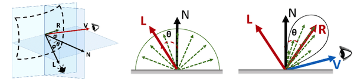

# 23 Light (Part II)

## 23.5 photon's life choices

light source(광원)에서 나온 **photon**(광자)가 일으킬 수 있는 현상들을 살펴보자.

- absorption: 물체에 흡수(흡수되지 않는 빛들은 reflection)

- reflection

  - **diffusion**: 난반사(여러 방향으로 골고루)

  - **specular**: 정반사(특정 방향으로). 
  
    > 거울 반사라고도 한다.

    > 보통 물체는 정도의 차이는 있어도 난반사와 정반사가 함께 일어난다.

- transparency: 물체를 빛이 통과(투명)

- refraction: 굴절

- fluorescence: 빛을 쏘면 빛의 자극에 의해서 물체가 발광(형광)

- phosphorescence: 빛을 쏜 뒤 광원을 제거해도 발광이 유지(인광)

  > 빛을 흡수하여 들뜬 물질이 에너지를 photon으로 다시 내놓는 과정은 형광과 동일하다. 하지만 시간이 지날수록 방출이 급격하게 감소하는 형광과 다르게 인광은 서서히 내놓으며 감소한다.

- subsurface scattering: 빛이 물체로 흡수가 되어 내부에서 몇 차례 반사된 뒤 나오는 현상(예: 피부, 우유 등)

- interreflection: 여러 물체 사이에서 계속 반사되는 현상.

  > 창문을 닫아도 방 안에서 빛들이 반사되어 환한 것이 바로 interreflection 현상이다.

---

## 23.6 basic models of reflection

> [reflection of light 정리](https://gofo-coding.tistory.com/entry/Lighting)

대부분 빛은 물체의 표면(surface)에서 모든 방향으로 반사된다. 그렇다면 반사되는 빛의 양(**intensity**)은 어떻게 나타낼까? 먼저 세 가지 가정을 통한 단순화가 필요하다.

- 표면은 fluorescent(형광) 성질을 갖지 않는다.

- 표면은 빛을 방출하지 않는다.

- 물체를 떠나는 모든 빛은, point에 도달하는 순간 즉시 떠난다.

> '빛이 표면에 닿았을 때 반사되는 빛의 양 비율'을 **albedo**( 기호: $\rho$ )라고 지칭한다.(비율이므로 0~1 사이 값을 갖는다.) 

여러 reflection 예시를 보자.

> **Lambertian Surface**: 어느 방향에서 보아도 brightness가 동일한 표면

---

### 23.6.1 diffuse reflection

**diffuse reflection**(난반사) model을 살펴보자.

- 어느 정도의 빛( $1 - \rho$ )은 흡수(absorb)된다.

- 나머지 빛은 산란(scatter)된다.(diffuse reflection)

이러한 diffuse reflection model 표면의 **illumination**을 설명하는 법칙으로 **Lambert's Cosine Law**가 있다.

> 주의할 사항으로 빛의 intensity는 viewer angle과는 하등 관련이 없다.

grayscale에서의 Lambert's Cosine Law은 다음과 같다.

$$ I(x) = {\rho}(x) (L \cdot \mathrm{N}(x)) $$

- $\rho$ : albedo. 온전히 물체의 특성에 의해 결정

  > albedo 대신 diffuse coefficient ( $k_{d}$ )과 incomming radiance( $I_{i}$ )로 대신하여 표현할 수 있다.

- $L$ : directional source(빛이 들어오는 각도)

    

    > 빛이 비스듬히 들어오는 경우(A), 표면이 받는 빛의 양이 적어진다.

- $\mathrm{N}$ : surface normal

- $I$ : reflected intensity

> 위 수식의 dot product 연산에서 cosine이 사용된다. cosine law라는 이름이 붙은 이유.

> color는 보통 R, G, B 3차원 각각의 intensity를 Lambert's Cosine Law으로 표현한다.

---

### 23.6.2 specular reflection

perfect mirror model에서 일어나는 ideal **specular reflection**(정반사)의 경우, 다음과 같이 반사가 일어난다.

- V = R: intensity $I_{e} = I_{i}$

  > e: emitting(나오는 빛), i: incomming(들어오는 빛)

- V $\neq$ R: 0 

near-perfect mirror(common model)일 경우, intensity는 R에서의 각도를 기준으로 큰 값을 갖게 된다.(highlight around R)

이때의 intensity를 수식으로 나타내면 다음과 같다.

$$ I_{e} = k_{s}(V \cdot R)^{n_{s}}I_{i} $$

- $k_{s}$ : specular coefficient (0~1 사이 값)

---

## 23.6.3 Lambertian + specular model

대부분의 경우에서 Lambertian과 specular component를 별개로 분리할 수 있다.

---

## 23.7 Bidirectional Reflection Distribution Function(BRDF)

**BRDF**(Bidirectional Reflection Distribution Function)은 빛이 표면에서 반사되었을 때, **특정 방향에서 본 표면이 얼마나 bright한지**를 정의한 4차원 함수이다.(general model of local reflection)

> 그림에서 주목할 부분은 illumination direction, surface normal, viewing direction이다.

- ${\theta}_{i}, {\phi}_{i}$ : incoming ray의 방향

- ${\theta}_{e}, {\phi}_{e}$ : outgoing ray의 방향

BRDF은 입사각과 반사각을 이용한 수식으로 표현된다.

$$ \rho ({\theta}_{i}, {\phi}_{i}, {\theta}_{e}, {\phi}_{e}) = {{L({\theta}_{i}, {\phi}_{i})} \over {E({\theta}_{e}, {\phi}_{e})}} $$

> 비율이므로 단위는 없다. 

---

### 23.7.1 BRDF for diffuse reflection

**Lambertian surface**에서의 BRDF를 살펴보자. 

Lambert's Cosine Law에 따라 반사되는 빛의 radiance는 다음과 같다.

$$ I_{e} = k_{d} (\mathrm{N} \cdot \mathrm{L}) I_{i} $$

여기서 BRDF은 다음과 같다.

$$ \rho ({\theta}_{i}, {\phi}_{i}, {\theta}_{e}, {\phi}_{e}) = k_{d}\cos{\theta}_{i} $$

---

## 23.8 parameterized reflectance model

물체의 반사를 나타내는 유명한 model로 다음과 같은 예시가 있다.

- computer graphics

  - Phong illumunation model

- physically-based model

  - Torrance-Sparrow model

  - Beckmann-Spizzichino model

---

### 23.8.1 Phong illumination model

Phong illumination model은 다음 3가지 component로 구성된다.

- ambient term: **inter-reflected light**를 compensate하는 항

- diffuse term

- specular term

반사되는 radiance는 다음과 같은 수식으로 표현된다.

$$ I_{e} = k_{a}I_{a} + I_{i}[k_{d}(\mathrm{N} \cdot \mathrm{L})_{+} + k_{s}(\mathrm{V} \cdot \mathrm{R})^{n_{s}}_{+}] $$

- $\mathrm{L}, \mathrm{N}, \mathrm{V}$ : unit vector

- $I_{e}$ : outgoing radiance

- $I_{i}$ : incoming radiance

- $I_{a}$ : ambient light

- $k_{a}$ : ambient light reflection coefficient

- $(x)_{+}$ : max(x, 0)

---
