# 24 Photometric Stereo (Part I)

> [Radiometry and Shading Models](http://www2.ece.ohio-state.edu/~aleix/Radiometry-Shading.pdf)

> [Photometric Stereo](https://web.yonsei.ac.kr/hgjung/Lectures/AUE859/9.%20Photometric%20Stereo.pdf)

> [Shape From Shading 정리](https://cdlee479.tistory.com/8)

**Photometric Stereo**란 다른 direction의 여러 광원(multiple sources)를 사용하여 측정한 image intensities를 사용해서 물체의 3D shape를 추정하는 방법이다. 

> surface normal, reflectance parameter(albedo)를 찾는 과정

- **Shape From Shading**(SFS): 이미지 한 장을 이용한 3D shape recovery

- **Photometric Stereo**(PS): 여러 이미지을 이용한 3D shape recovery

  > shape from shading으로 통칭하기도 한다.

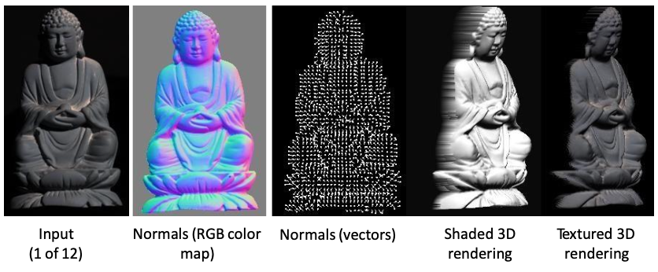

> surface normal vector에 주목하자.

> surface normal과 reflectance를 알고 있다면 어떤 light 환경에 둬도 렌더링이 가능하다.(relighting)

이러한 복원은 기본적으로 **shading**을 이용한다. shading이란 물체의 표면이 빛을 받으면 생기는 brightness variation를 말한다.

---

## 24.1 assumptions for photometric stereo

photometric stereo는 몇 가지 가정을 한다.

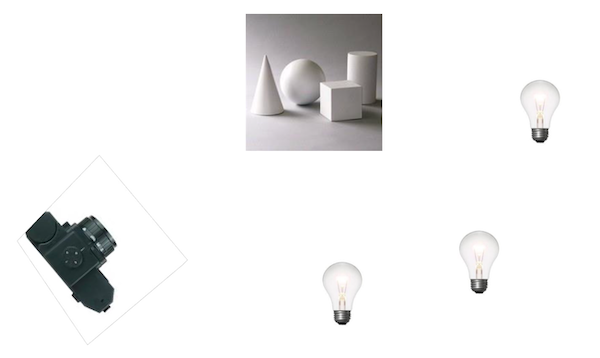

- 물체는 Lambertian object이다.

- local shading model: 표면의 각 point는 해당 point에서 visible한 광원의 영향만을 받는다.

- light source의 방향을 알고 있다.

- light source의 배치를 다르게 하면서, 정확히 동일한 카메라/물체 구성에서 이미지를 얻는다.

- orthographic projection이다.(모든 빛이 평행하게 들어온다.)

이러한 가정을 통해 어떠한 값을 알고, 무엇을 구해야 하는지를 보자.

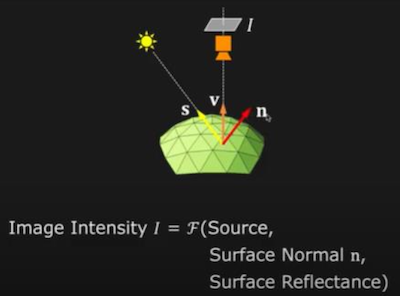

- $\mathrm{S}$ : source vectors(known)

- $\mathrm{N}$ : surface normal(**unknown**)

  - $\mathrm{N}$의 크기는 1이다. $\mathrm{N} \cdot \mathrm{N} = 1$ 

$$\mathrm{N} = (n_x, n_y, n_z) = \mathrm{N}({\sigma}_{n}, {\tau}_{n})$$

- Surface Reflectance(albedo)(known)

photometric stereo를 통해 아래와 같은 surface normal map을 얻을 수 있다.

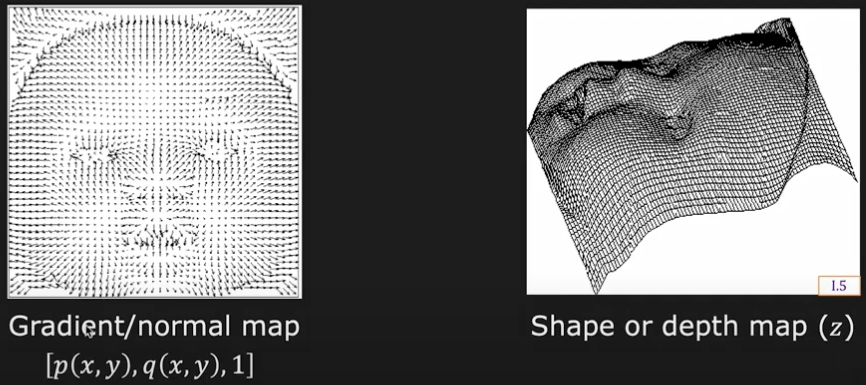

- $p(x,y), q(x,y), 1$ : unit normal

- 왼쪽 normal map은 depth map(height map)에 대응된다.

본격적으로 surface normal map을 사용하여 depth를 추정하는 계산법을 알아보자.

---

## 24.2 surface normal map

> [3차원 공간에서의 곡면, 조각](https://mathphysics.tistory.com/1105)

surface model로 **Monge patch**를 사용한다. 

- 어떠한 곡면의 방정식 $F(x, y, z) = 0$ 의 식을 적절히 변경하면 $z=f(x,y)$ 꼴로 나타낼 수 있고, 정의역을 적절히 조절하면 함수처럼 활용할 수 있다.

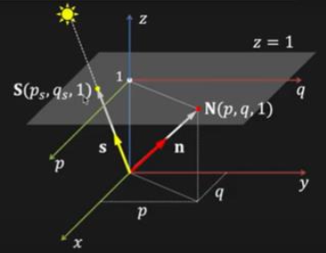

- surface gradient

$$ \left( - {{\partial}z \over {\partial}x} , - {{\partial}z \over {\partial}y} \right) = (p, q) $$

- surface normal

$$ \left( - {{\partial}z \over {\partial}x} , - {{\partial}z \over {\partial}y} , 1 \right) = (p, q, 1) $$

- unit surface normal

$$ \mathrm{N} = {{\mathrm{N}} \over {||\mathrm{N}||}} = {(p, q, 1) \over {\sqrt{p^{2} + q^{2} + 1}}} $$

surface는 다음과 같이 surface gradient의 적분으로 나타낼 수 있다.

$$ z(x,y) = z(x_0, y_0) + \int_{(x_0, y_0)}^{(x,y)} -(pdx + qdy) $$

- $(x_0, y_0)$ : reference point

  - $z(x_0, y_0) = 0$ 가 되는 점을 정하고, 이를 바탕으로 depth를 계산한다.

    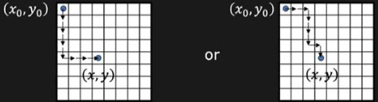

### <span style='background-color: #393E46; color: #F7F7F7'>&nbsp;&nbsp;&nbsp;📝 예제 1: Monge patch&nbsp;&nbsp;&nbsp;</span>

간단한 곡면의 방정식이 있다.

$$ S_{i} = \{(x, y, z) \in \mathbb{R^{3}} | x^2 + y^2 + z^2 = 1 \} $$

위 식을 $z=f(x,y)$ 꼴로 나타내어라.

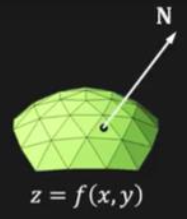

### <span style='background-color: #C2B2B2; color: #F7F7F7'>&nbsp;&nbsp;&nbsp;🔍 풀이&nbsp;&nbsp;&nbsp;</span>

곡면은 원점에서 단위 길이의 거리에 있는 점 $\mathrm{p}$ 의 집합으로 볼 수 있다.

```math
||\mathrm{p}|| = \sqrt{{p}^{2}_{1} + {p}^{2}_{2} + {p}^{2}_{3}} = 1
```

여기서 xy 평면 위에 위치한 곡면의 각 점 $(q_1, q_2, q_3)$ 을 xy평면으로 projection하면, $D : x^2 + y^2 = 1, z = 0$ 사이의 일대일 대응 함수를 얻을 수 있다.

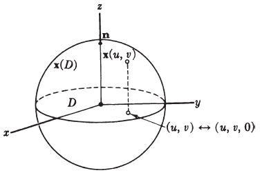

이러한 일대일 대응 함수를 $\mathrm{x}(u, v) = (u, v, \sqrt{1 - u^2 - v^2})$ 로 나타낼 수 있다. 

- regular mapping(정칙 사상)임을 보이기 위해 식을 $f = \sqrt{1 - u^2 - v^2}$ 로 표현할 수 있다.

  > Jacobian matrix(야코비 행렬)을 계산하면, $\mathrm{x}$ 가 정칙 사상임을 증명할 수 있다.

함수 $f$ 가 $\mathbb{R^{2}}$ 의 열린 집합 $D$ 에서 정의된 미분가능한 실함수라면, $\mathrm{x} : D \rightarrow \mathbb{R^{3}}$ 는 다음과 같이 정의된다.

$$ \mathrm{x}(u, v) = (u, v, f(u, v)) $$

정리하면 $\mathbb{R^{2}}$ 에서 정의된 곡면 $M : z = f(x, y)$ 의 미분가능한 실함수 $f$ 는, $\mathbb{R^{3}}$ 상의 곡면 $M$ 을 결정한다.

---

## 24.3 reflectance map

> [영상 이해: Reflectance Map](http://www.aistudy.com/physiology/vision/image_dean.htm)

표면의 point (x, y)에서의 image intensity를 나타내는 함수를 **reflectance map**(반사율 지도)이라고 한다.

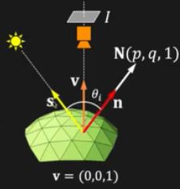

- ${\theta}_i$ : surface normal $\mathrm{n}$ 과 source direction $\mathrm{s}$ 의 각도

> source direction $\mathrm{s}$ , surface reflectance(albedo)를 이미 알고 있다.

$$ I = R(p, q) $$

### <span style='background-color: #393E46; color: #F7F7F7'>&nbsp;&nbsp;&nbsp;📝 예제 2: Reflectance map: Lambertian case&nbsp;&nbsp;&nbsp;</span>

물체가 Lambertian surface일 때의 reflectance map을 구하라.

- 다음과 같은 조건을 가정한다.

$$c{{\rho} \over {\pi}}k = 1$$

### <span style='background-color: #C2B2B2; color: #F7F7F7'>&nbsp;&nbsp;&nbsp;🔍 풀이&nbsp;&nbsp;&nbsp;</span>

Lambertian surface(ideal diffuse)에서의 reflectance map은 다음과 같이 계산할 수 있다.

$$ I = c {{\rho} \over {\pi}}{{J} \over {r^2}} \cos{\theta}_{i} = c{{\rho} \over {\pi}}k(\mathrm{n} \cdot \mathrm{s}) $$

- $c$ : constant(Camera Gain)

- $\rho$ : surface albedo (reflectance)

- $k(\mathrm{n} \cdot \mathrm{s})$ : source brightness

문제에서 가정한 조건을 보자.

$$c{{\rho} \over {\pi}}k = 1$$

가정에 따라 image intensity는 다음과 같이 나타낼 수 있다.

$$ I = \cos {\theta}_{i} = \mathrm{n} \cdot \mathrm{s} $$

실제 좌표를 대입하여 reflectance map을 구할 수 있다.

```math
I = \mathrm{n} \cdot \mathrm{s} = {{pp_s + qq_s + 1} \over {{\sqrt{{p}^2 + {q}^2 + 1}}{\sqrt{{p}^{2}_{s} + {q}^{2}_{s} + 1}}}} = R(p, q)
```

---

### 24.3.1 Iso-Brightness Contour

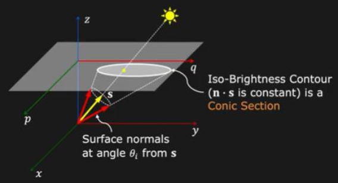

source direction( $p_s, q_s$ )에 따른 reflectance map을, **iso-brightness contour**(등광도 윤곽선)으로 나타낼 수 있다. 

- light source가 viewer와 가까운 경우

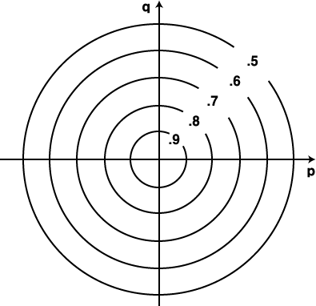

- light source가 viewer에서 멀리 떨어진 경우(빛이 평행하게 들어온다.)

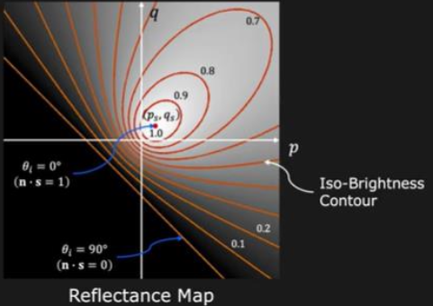

이처럼 각 pixel의 intensity는 iso-brightness contour을 따라 mapping된다.

---

## 24.4 basic idea of photometric stereo

point $(x, y)$ 에서의 surface normal은, 어떠한 광원에 따른 intensity $I_{1}(x,y)$ 에 해당되는 iso-brightness contour을 만족할 것이다.

그렇다면 여기서 광원을 하나 더 늘리면, 두 iso-brightness contour의 교점을 구할 수 있을 것이다.

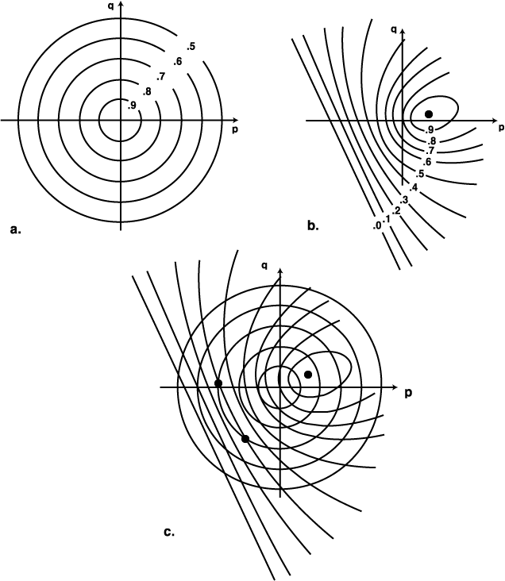

이처럼 다른 광원을 사용하여 얻은 iso-brightness contour의 교점을 구하는 것으로, point $(x, y)$ 에서의 surface normal을 추정할 수 있다. 이것이 바로 **photometric stereo**의 기본 아이디어이다.

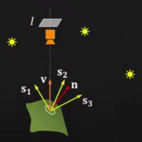

- source $i$ 의 direction: $(p_{s_{i}} , q_{s_{i}})$

- source $i$ 의 reflectance map: $R_{i}(p, q)$

- source $i$ 에 의해 만들어진 image intensity: $I_{i}(x, y)$

---

### 24.4.1 Photometric Stereo: Lambertian Case

Lambertian Case에서의 예시를 보자. 세 light source에서의 image intensities는 다음과 같다.

$$ I_{1} = {{\rho} \over {\pi}}\mathrm{N} \cdot \mathrm{S}_{1} $$

$$ I_{2} = {{\rho} \over {\pi}}\mathrm{N} \cdot \mathrm{S}_{2} $$

$$ I_{3} = {{\rho} \over {\pi}}\mathrm{N} \cdot \mathrm{S}_{3} $$

이때 위 식을 행렬 연산 꼴로 나타낼 수 있다.

$$ \begin{bmatrix} I_{1} \\ I_{2} \\ I_{3} \end{bmatrix} = {{\rho} \over {\pi}} \begin{bmatrix} S_{x_1} & S_{y_1} & S_{z_1} \\ S_{x_2} & S_{y_2} & S_{z_2} \\ S_{x_3} & S_{y_3} & S_{z_3} \end{bmatrix} \mathrm{n} $$

위 식에서 유의할 점은 좌항 Intensity는 measured 값이며 $S_{3 \times 3}$ 은 known 값이다. 따라서 식을 정리하여 surface vector $\mathrm{N}$ 을 얻을 수 있다. 

식을 간단하게 표기하자.

$$ I = S \mathrm{N} $$

- $\mathrm{N} = {\rho \over \pi} \mathrm{n}$ 

이때 surface vector는 다음과 같이 정의할 수 있다.

$$ N = (S)^{-1}I $$

- Surface Normal

$$ \mathrm{n} = {{\mathrm{N}} \over {||\mathrm{N}||}} $$

- albedo

$$ {\rho \over \pi} = ||\mathrm{N}|| $$


---

### 24.4.2 when does it not work?

하지만 위 계산에서 $S_{3x3}$ 이 **not invertible**하다면 문제가 발생한다.

- 한 source direction이 다른 두 source direction의 linear combination인 경우라면 $S_{3x3}$ 은 invertible하지 않다.

  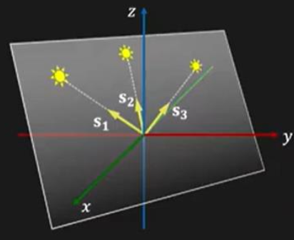

$$ s_{3} = \alpha s_{1} + \beta s_{2} $$

---

### 24.4.3 more sources than minimum needed

그렇다면 source를 더 늘리면 어떻게 될까? minimum보다 큰 $K > 3$ 개 sources를 사용하면 더 좋은 결과를 얻을 수 있다.

- $S_{k\times3}$ : square matrix가 아니며, not invertible하다.

  - 따라서 Least Squares Estimation을 적용한다.

    > $S^{T}S$ : $3 \times 3$

    > $(S^{T}S)^{-1}S^{T}$ : pseudo inverse

$$ S^{T}I = S^{T}S \mathrm{N} $$

$$ N = (S^{T}S)^{-1}S^{T}I $$

---

## 24.5 calibration based photometric stereo

1. K $\ge$ 3 개의 서로 다른 light sources를 이용하여 이미지를 얻는다.

   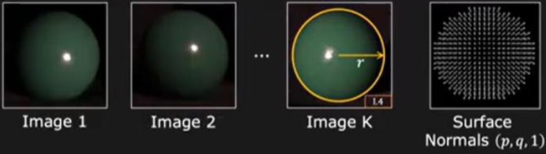

   - 구면 각 point의 image intensities: $(I_1, I_2, \cdots, I_K)$

2. 각 point의 surface normal을 추정한다.

3. 이를 바탕으로 lookup table을 만든다.

   - K-tuple

      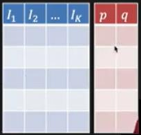

4. 동일한 K 개 light sources에서 K 개 이미지를 얻는다.

   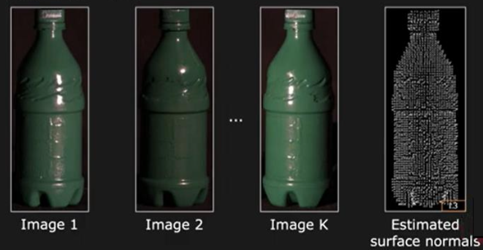

5. 각 pixel에서 lookup table을 이용해 $(I_1, I_2, \cdots, I_K) \rightarrow (p, q)$ 로 mapping한다.

---

