# 25 Depth from Defocus

> [Point Spread Function | Depth from Defocus](https://www.youtube.com/watch?v=BzucsB8t1mc)

이미지가 얼마나 defocus되어 있는지를 알아내면, point의 depth를 계산할 수 있다. 

- defocus는 blur 수준에 따라서 파악할 수 있다.

---

## 25.1 Gaussian Lens Law, Blur circle diameter

image plane와 lens가 있을 때, focal length를 구하는 **Gaussian lens law**는 다음과 같다.

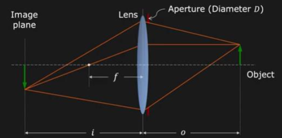

- $f$: focal length

$$ {1 \over f} = {1 \over i} + {1 \over o} $$

그런데 여기서 image plane뿐만 아니라 image sensor를 추가로 고려해 보자.

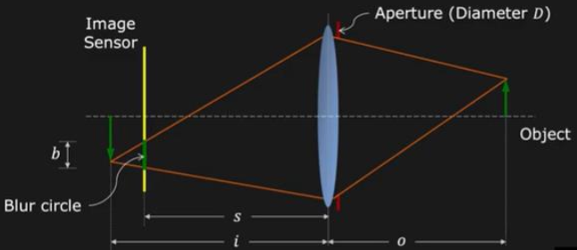

- $D$ : 조리개(aperture)의 반지름(Diameter)

similar triangle에 따라 다음과 같은 식을 얻을 수 있다.

$$ {b \over D} = |{{i - s} \over {i}}| $$

위 식을 정리하면 blur circle diameter를 구할 수 있다.

$$ b = D|1 - {s \over i}| $$

- image sensor가 image plane에서 멀어질수록 biur circle $b$ 는 커진다.

- lens의 diameter $D$ 를 줄이면(조리개를 작게 열면) biur circle $b$ 는 작아진다.

---

## 25.2 Point Spread Function

그렇다면 이러한 blur circle에서 빛은 어떻게 distribution 될까? 이를 설명하는 함수가 바로 **Point Spread Function**(PSF, 점퍼짐 함수)로, 점 광원(point source)에 대한 camera system의 response를 나타낼 수 있다.(**impulse**)

가장 간단한 모델인 Pillbox(Disk) PSF를 보자. blur circle의 직경을 $b$ 라고 할 때, 중심을 기준으로 빛이 균일하게 분포한다.

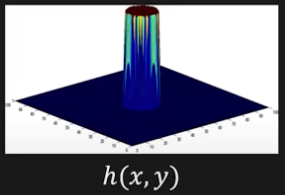

- $x^2 + y^2 \le {b^2} / {4}$

$$ h(x,y) = {4 \over {\pi b^2}}$$

- otherwise: $0$

하지만 실제로는 aperture 자체에서 발생하는 **diffraction**(회절)이나, **lens aberrations**(색수차, 렌즈 결함 등)과 같은 요소가 blur circle 내 빛의 분포가 균일하지 않게 만든다. 따라서 PSF는 대체로 **Gaussian function** 형태를 띈다.

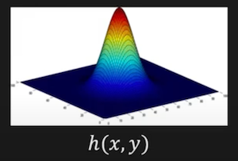

- $\sigma = b/2$ (approximation)

$$ h(x, y) = {1 \over {2\pi {\sigma}^2}} e^{- {{(x^2 + y^2)} \over {2{\sigma}^2}}}  $$

---

### 25.2.1 Defocus as Convolution

아래 이미지의 scene depth가 constant하다고 가정하자.(perfectly focused)

PSF patch를 적용할 것이다. 이러한 상황에서 defocus는 linear하고 shift invariant하므로 convolution 연산과 같다.

---

### 25.2.2 Defocus in Fourier Domain

- focus: high-pass filter

- defocus: low-pass filter

---

## 25.3 Depth From Focus

> [Depth from Focus | Depth from Defocus](https://www.youtube.com/watch?v=A-fgaR7vJ-w)

이제 focus 혹은 defocus를 기반으로 depth를 복구하는 방법을 살펴볼 것이다. 우선 focus를 기반으로 한 방법을 **Depth from Focus**라고 한다. 기본적으로 다른 focus level에서 이미지를 촬영하고, 이를 기반으로 depth를 추정한다.

- 각 small image patch마다 best focused를 찾는다.

  - scene depth(camera lens부터 object까지의 distance)는 Gaussian lens law를 통해 계산할 수 있다.

$$ {1 \over f} = {1 \over i} + {1 \over o} \rightarrow o = {{if} \over {i - f}} $$

### <span style='background-color: #393E46; color: #F7F7F7'>&nbsp;&nbsp;&nbsp;📝 예제 1: Depth From Focus&nbsp;&nbsp;&nbsp;</span>

focal length $f=50$ mm일 때, scene depth $o$ 를 구하라.

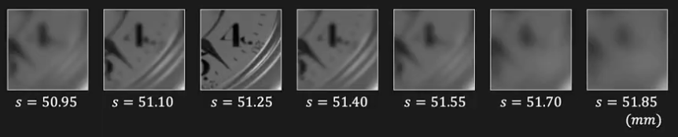

- s: sensor location

### <span style='background-color: #C2B2B2; color: #F7F7F7'>&nbsp;&nbsp;&nbsp;🔍 풀이&nbsp;&nbsp;&nbsp;</span>

best focused 때의 sensor location $s=51.25$ mm이다.

$$ o = {{if} \over {i - f}} = {{50 \times 51.25} \over {51.25 - 50}} = 2.05 \text{m} $$

---

### 25.3.1 Focus Measure

그렇다면 best focused image를 어떻게 얻을 수 있을까? 

- focused image: small path 내 high frequency content가 많다.

  - 이는 high-path filter를 사용하면 정도를 알 수 있다.

$$ {\triangledown}_{M}^{2}f = |{{{\partial}^2 f} \over {{\partial} x^2}}| + |{{{\partial}^2 f} \over {{\partial} y^2}}| $$

> x, y에서의 2차 도함수의 절대값. Laplacian과 비슷하다.

그리고 small window에서 Laplacian responses의 제곱값을 모두 더하면 **focus measure**를 얻을 수 있다.

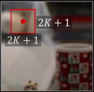

- 각 pixel size: (2K+1, 2K+1)

```math
M(x, y) = {\sum}_{i=x-K}^{x+K} {\sum}_{i=y-K}^{y+K} {\triangledown}_{M}^{2}f(i,j)
```

---

### 25.3.2 Gaussian Interpolation

그런데 depth는 오직 sensor location에만 따라 달라진다. 따라서 sensor location의 variation이 N개라면, depth도 N개 존재한다. sensor loaction에 따른 focus measure는 **Gaussian-like function**으로 나타난다.

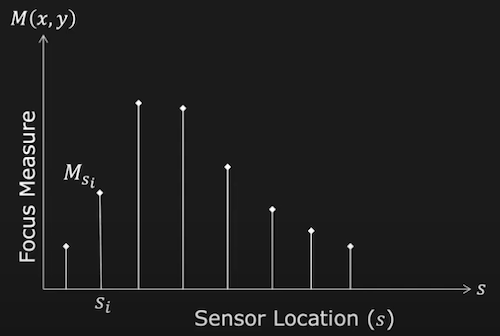

> 물체가 어떤 표면을 갖든, 넓이의 차이는 있을 수 있지만 Gaussian-like function으로 나타난다.

즉, peak(best focus) 값을 추정할 수 있다.

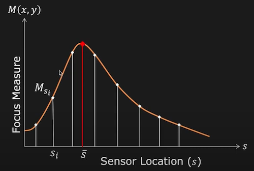

$$ M_{s} = M_{p} \exp\{-{1 \over 2}\left( {s - \bar{s}} \over {{\sigma}_M} \right)^2\} $$

- unknown

    - $\bar{s}$ : peak sensor location

    - $M_p$ : peak value

    - ${\sigma}_M$ : width of Gaussian

- known

    - $M_s$ : focus measure at sensor location $s$

    - $s$ : sensor location

그렇다면 $M_{p}$ 를 구하기 위한 $s_i$ sample은 얼마나 필요할까? 

- 위 방정식에 자연 로그를 취해서 식을 분해하면 다음과 같다.

$$ \ln M_{s} = \ln M_{p} -{1 \over 2}\left( {s - \bar{s}} \over {{\sigma}_M} \right)^2 $$

위 식은 $y = x - z^2$ 와 같은 2차 함수의 형태로 볼 수 있다. 이 말은 총 3개의 sample(sensor location)이 있으면 $M_p$ 를 구할 수 있다는 것을 의미한다.

> 이렇게 얻은 $\bar{s}$ 를 Gaussian lens law에 대입하는 것으로 depth를 구할 수 있다.

> 하지만 이러한 이유 때문에 Depth from Focus 방식에서는 이미지를 많이 필요로 한다. 

---

## 25.4 Depth from Defocus

> [Depth from Defocus | Depth from Defocus](https://www.youtube.com/watch?v=ReSDyfrKJEQ)

Depth from Defocus는 얼마나 defocus된지를 계산하여 depth를 추정한다.


- blur circle diameter

$$ o = {{if} \over {i - f}} $$

- Gaussian lens law

$$ {b \over D} = {{i - s} \over {i}} $$

위 두 식을 합치면 다음과 같다.

$$ o = {{sf} \over {s - f + b(f/D)}} $$

이제 blur size $b$ 를 어떻게 구할지 고민해야 한다. 현재 알고 있는 것은 오직 image patch에 관한 정보다.

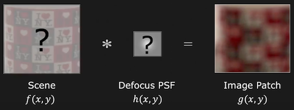

그렇다면 이미지가 두 개 있다면 어떨까? 동일한 scene에서 다음의 Defocus PSF를 다르게 조절한다. 

```math
h_{{\sigma}_1}(x, y), h_{{\sigma}_2}(x, y)
```

> ${\sigma}_1, {\sigma}_2$ 는 조리개를 얼마나 여는가에 따라 달라지게 할 수 있다.

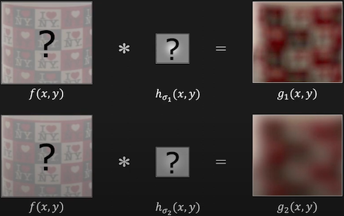

- 방정식 2개와 미지수 3개( $f(x,y), {\sigma}_1, {\sigma}_2$ )가 있다.

  - ${\sigma}_1, {\sigma}_2$ 는 조리개에 의해 결정되므로 아래 식을 따른다.

    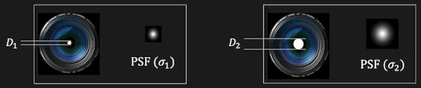

$$ {{\sigma}_1 \over {\sigma}_2} = {{D1} \over {D2}} $$

이렇게 방정식 세 개와 미지수 3개를 확보했다.

$$ g_{1}(x,y) = f(x, y) * h_{{\sigma}_1}(x,y) $$

$$ g_{2}(x,y) = f(x, y) * h_{{\sigma}_2}(x,y) $$

$$ {{\sigma}_1 \over {\sigma}_2} = {{D1} \over {D2}} $$

---

### 25.4.1 Naive DFD

위 세 방정식을 Fourier Domain에서 계산해 보자.

$$ G_{1}(u, v) = F(u, v) \times H_{{\sigma}_1}(u, v) $$

$$ G_{2}(u, v) = F(u, v) \times H_{{\sigma}_2}(u, v) $$

$$ {{\sigma}_1 \over {\sigma}_2} = {{D1} \over {D2}} $$

식을 다음과 같이 전개할 수 있다.

```math
{{G_{1}(u, v)} \over {G_{2}(u, v)}} = {{F(u, v) \times H_{{\sigma}_1}(u, v)} \over {F(u, v) \times H_{{\sigma}_2}(u, v)}} = {{H_{{\sigma}_1}(u, v)} \over {H_{{\sigma}_2}(u, v)}}
```

```math
= {{\exp(-2 {\pi}^2 (u^2 + v^2) {\sigma}_{1}^2 )} \over {\exp(-2 {\pi}^2 (u^2 + v^2) {\sigma}_{2}^2 )}}
```

로그를 취해서 양변을 정리하자.

```math
{{\sigma}_1}^2 - {{\sigma}_2}^2 = {{\ln G_{2}(u,v) - \ln G_{1}(u,v)} \over {2 {\pi}^2 (u^2 + v^2) }}  
```

$$ {{\sigma}_1 \over {\sigma}_2} = {{D1} \over {D2}} $$

${σ}_1$ 나 ${σ}_2$ 중 하나만 있으면 위 식을 해결할 수 있다. 여기서 문제는 $G_{1}$ 과 $G_{2}$ 를 사용할 때 high frequency 값을 사용해야 한다는 점이다.

> 따라서 이 접근법은 noise에 민감하다.

---

### 25.4.2 Reconstruction-Based DFD

---

### 25.4.3 Capturing Defocused Images

---

## 25.5 Active Illumination Methods

---
