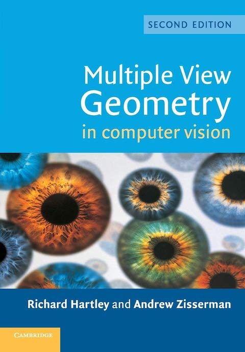

  
<h1 align="center">
  
Multiple View Geometry in Computer Vision

  
</h1>
  
<b>Richard Hartley, Andrew Zisserman 저</b> 
Cambridge University Press · 2004년 3월 25일 출시 
[[figures](https://www.robots.ox.ac.uk/~vgg/hzbook/hzbook2/HZfigures.html)] | [[Matlab code](https://www.robots.ox.ac.uk/~vgg/hzbook/)]</b> 

## :bulb: 목표

- **Computer Vision 개념을 공부한다.**

  > Computer Vision 분야의 기본 개념을 공부하고, 이를 바탕으로 다양한 Computer Vision 알고리즘을 구현해본다.

 

## 🚩 정리한 문서 목록

### 🖼 Image

 - [Image Formation](https://github.com/erectbranch/Multiple_View_Geometry_in_Computer_Vision/tree/master/Part0/summary01)

   > intensity, pinhole camera, focal length, properties of projection(distant, vanishing point), geometric properties

   > COP, PP, Euclidean space, homogeneous coordinates, point at infinity, line at infinity

   > DOF(Degree Of Freedom)

 

## :mag: 목차

  > [한글 목차](https://product.kyobobook.co.kr/detail/S000061584858)

    1. Introduction - a tour of multiple view geometry

### Part 0. The Background: Projective Geometry, Transformations and Estimation(사영기하학, 변형과 추정)

    2. Projective geometry and transformations of 2D

    3. Projective geometry and transformations of 3D

    4. Estimation - 2D projective transforms

    5. Algorithm evaluation and error analysis

### Part I. Camera Geometry and Single View Geometry(카메라 기하학과 단일 시점 기하학)

    6. Camera models

    7. Computation of the camera matrix

    8. More single view geometry

### Part II. Two-View Geometry(이중 시점 기하학)
 
    9. Epipolar geometry and the fundamental matrix

    10. 3D reconstruction of cameras and structure

    11. Computation of the fundamental matrix F

    12. Structure computation

    13. Scene planes and homographies

    14. Affine epipolar geometry

### Part III. Three-View Geometry(삼중 시점 기하학)

    15. The trifocal tensor

    16. Computation of the trifocal tensor T

### Part IV. N-View Geometry(N개 시점 기하학)

    17. N-linearities and multiple view tensors

    18. N-view computational methods

    19. Auto-calibration

    20. Duality

    21. Chirality

    22. Degenerate configurations

### Part V. Appendices

    Appendix 1. Tensor notation

    Appendix 2. Gaussian (normal) and chi-squared distributions

    Appendix 3. Parameter estimation. Appendix 4. Matrix properties and decompositions

    Appendix 5. Least-squares minimization

    Appendix 6. Iterative Estimation Methods

    Appendix 7. Some special plane projective transformations
