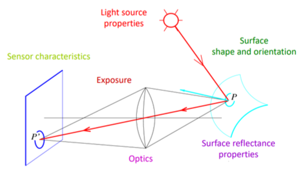
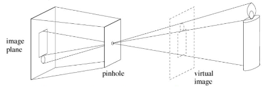
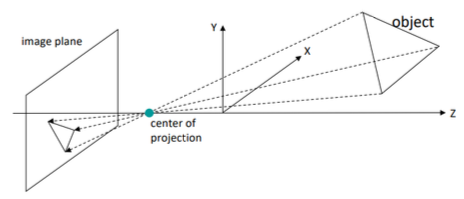
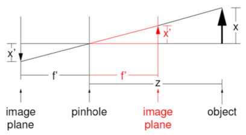
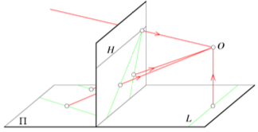
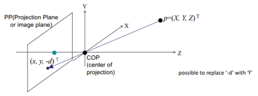

# 2 Image Formation

**image**란 3D world를 2D image plane으로 projection한 것을 말한다.(2-dimensional patterns of brightness values)

---

## 2.1 Image Formation

**image formation**(이미지 형성)에 영향을 미치는 요소는 다양하다. 예를 들면 태양이나 전구와 같은 light source(energy resource)가 필요하며, light source의 특징에 따라서도 image formation이 달라진다. light가 물체에 도달하면 반사되어 카메라와 같은 imaging system에 도달하게 된다.

- light source properties

- surface shape and orientation: 물체 표면의 방향성, 질감, 색깔 등에 따라 다르다.

- optics: 렌즈가 어떤 종류인지 따라 다르다.(굴절률, 렌즈의 종류 등)

- sensor characteristics: 조리개, 셔터 스피드 등

---

## 2.2 structure of ambient light

**ambient light**(주변광, 환경광)란 scene 내 모든 object들에게 전 방향에서 비춰주는 조명을 의미한다. 자연적(태양 또는 달, 주변 불빛)이 해당된다. light의 **intensity**는 $P$ 는 다음과 같은 요인들에 의해 결정된다.

> 빛 a가 물체 A에 부딪혀 반사된 뒤 물체 B에 도달했다면, 빛 a는 물체 B에 대한 ambient light라고 지칭할 수 있다.

> elevation angle(고각, 고도각): 수평선에서 측정한 태양의 각 높이를 의미한다.

$$ P (q, f, l, t, X, Y, Z) $$

- 3D for viewpoint (X, Y, Z)

- 2D for ray direction (q, f)

- 1D for wavelength(colors) (l)

- 1D for time (t)

---

## 2.3 Cameras

- pinhole projection model

    - qualitative properties

    - perspective projection matrix

- cameras with lenses

- digital cameras

---

### 2.3.1 Pinhole Camera

옛날 필름을 이용한 카메라에서는, 필름 한 픽셀에 매우 적은 빛(pencil of lay)만 받도록 제한을 해야만 했다. 맨 처음 이러한 방식으로 만든 카메라가 camera obscura(암상자 카메라)이며, 이러한 방식의 카메라를 **pinhole camera**라고 한다.

이제 그림을 보며 pinhole camera에 object가 어떻게 맺히는지 수식으로 나타내 보자. object X는 카메라 내부 image plane X'에 맺히게 된다.

> 빨간색 선: reflected image plane. 이를 이용한 측량도 가능하지만 정확히 정면에서 찍어야만 가능하다.

- f': **focal length**(초점 거리)로 'pinhole(바늘 구멍)에서 뒷 벽면까지의 거리'를 의미한다.

   > 일반적으로 **focal length**(초점 거리)는 렌즈 ~ image sensor까지의 거리를 의미한다.

- Z: object가 camera에서 떨어진 거리

맺힌 image X'는 다음과 같이 나타낼 수 있다.

$$ X' = (f' / Z) X $$

> 이러한 특징 때문에, object와 camera가 떨어진 거리 Z가 멀수록 맺히는 image X'도 작아진다.

---

## 2.4 properties of projection

projection의 특징을 알아보자.

- object가 camera와 멀리 떨어질수록 image는 작아진다.

- parallel lines(평행선)는 **vanishing point**(소실점) 한 점으로 모이게 된다.(converge) 

    

    space(공간)상 **모든 direction은 각자의 vanishing point를 가지고 있다.**

    > 하지만 **image plane과 평행한 line들**만큼은, image 내에서도 **여전히 parallel**하게 남는다.

    > (2차원 projective space) vanishing point들을 모으면 하나의 직선이 된다. 이를 **line at infinity**라고 한다.

참고로 아래와 같은 두 직선의 방정식이 있다고 할 때, $a = a', b = b'$ 를 만족하지만 $c \neq c'$ 인 경우 두 직선이 **parallel**하다.

$$ ax + by + c = 0 $$

$$ a'x + b'y + c' = 0 $$

projection의 geometric properties로는 다음과 같은 종류가 있다.

- points(점): points가 된다.

- lines(직선): lines가 된다.

- planes(평면): whole image 혹은 half-plane이 된다.

    > 공간 위에 한 직선은 그 plane을 두 부분으로 나누는데, 각각을 half-plane(반평면)이라고 한다.

- polygons(다각형): polygons가 된다.

- **degenerates** case: focal point(초점)을 지나는 경우

    - line: point가 된다.

    - plane: line이 된다.

---

## 2.5 Coordinate System

**approximation**(근사)를 하기 위해 앞서 본 pinhole model을 사용해 보자. 다음과 같은 좌표계를 상정한다.

- origin(원점): **COP**(Center Of Projection)를 위치시킨다.(optical center)

- COP 뒤쪽에 image plane(**Projection Plane**, **PP**)을 위치시킨다.

3차원상 하나의 Ray는 projective space에서 하나의 점으로 projection된다. 이를 효율적으로 나타내기 위해서 사용하는 것이 **homogeneous coordinates**이다.

> image는 3차원 공간에 있는 point들을 PP에 projection한 것이다. focal point와 projection된 point를 연결하면 하나의 긴 projection ray(투영선)이 나온다. 이 ray에 위치한 모든 점은 동일한 한 point로 projection된다.

> 따라서 하나의 point로 projection되는 모든 point들을 한꺼번에 표현할 수 있는 좌표계가 있다면 효과적일 것이다. 이것이 바로 homogeneous coordinates을 사용하는 이유다.

> 참고로 우리가 사는 실제 3차원 공간은 Euclidean space(유클리드 공간) ${\mathbb{R}}^3$ 이라고 부른다.

---

### 2.5.1 Homogeneous Coordinates

homogeneous coordinates를 쉽게 말하면, (Euclidean plane) image상의 (wx, wy)를 (wx, wy, w)로 확장하여 표현하는 것이다. 즉, scale은 무시된 채 (x,y)에 대한 좌표 표현만 무한히 많이 존재하게 된다.

> 3차원의 경우 (X, Y, Z)를 (wX, wY, wZ, 1)로 표현한다.

다시 말해 homogeneous coordinates에서 다음 두 좌표는 같다.

$$ (x, y, \alpha) = ({{x} \over {\alpha}}, {{y} \over {\alpha}}, 1) $$

역으로 homogeneous coordinates를 일반 좌표계로 변환하는 것도 가능하다. 끝 좌표가 1이 되도록 scale을 바꾼 후 1을 떼 내면 된다.

$$ (x, y, \alpha) = ({{x} \over {\alpha}}, {{y} \over {\alpha}}, 1) \rightarrow ({{x} \over {\alpha}}, {{y} \over {\alpha}}) $$

이제 점 (X, Y, Z)에서 COP로 향하는 ray의 intersection을 계산해 보자.

$$ (X,Y,Z) \rightarrow (-d{{X} \over {Z}}, -d{{Y} \over {Z}}) $$

혹은 다음과 같이 나타낼 수 있다.

$$ (X,Y,Z) \rightarrow (f{{X} \over {Z}}, f{{Y} \over {Z}}) $$

---
